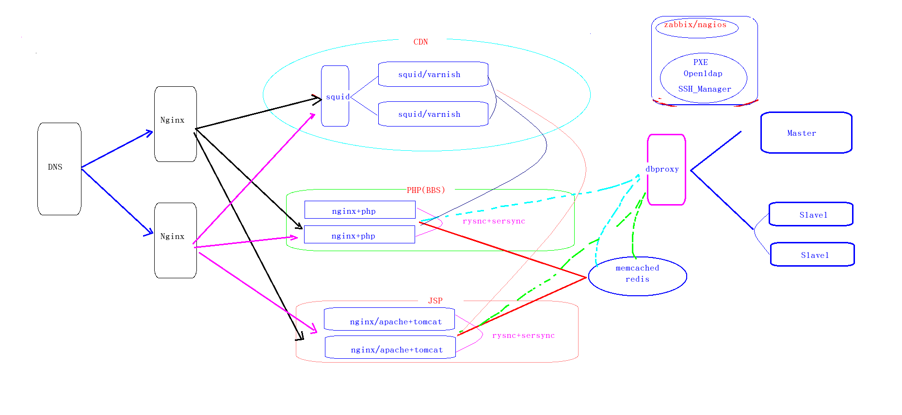

##项目说明
项目名称: ABC公司IDC机房托管中心项目实施


项目要求：
     1.租用IDC机房机柜,机柜带宽,服务器性能自己挑选
     2.使用pxe(cobbler)批量安装系统与初始化配置（规划IP地址）
     3.服务器采用2网卡设计,接入公网与内网IP
     4.实现智能DNS，方便公网用户快速访问
     5.采用LNMP架构，实现ABC公司论坛到搭建，论坛采用PHP语言开发
     6.采用nginx+tomcat+jdk+jsp页面,实现对公司企业网站的WEB实现
     7.使用nginx调度器，对2套网页(php,jsp)负载均衡
     8.采用CDN架构(squid/varnish)实现静态数据加速
     9.采用rsync-sersync将所有服务器数据实现一致性
    10.安装mysql集群实现一主多从,通过读写分离实现主读从写
    11.使用redis或者memcache对PHP加速缓存，解决JSP会话一致性
    12.采用openldap，实现对服务器帐号集中制管理
    13.设计内网ssh管理方案
    14.设置公网防火墙,对ssh与http协议开放
    15.使用监控系统cacti,nagios,zabbix监控主机资源及时报警
    16.IDC托管中心考察广州几家：如唯一网络,长城带宽等(各种费用)
 

说明(思路)
 1) 搭建pxe批量安装系统(kvm克隆)
 2) 安装后端数据库实现mysql读写分离与主从复制(建议5台[1台])
 3) 安装servsync实现页面一致性的发布(NFS共享存储) 
 4) 安装nginx+php+memcache/redis(php论坛) bbs.abc.com  2台
 5) 安装nginx+tomcat+jdk+jsp+memcache(jsp企业网站) www.abc.com 2台
 6) 安装nginx反向代理服务器(调度器)实现负载均衡(轮循) 1台
 7) 安装squid或者varnish实现静态缓存加速（CDN）2台
 8) 安装nginx反向代理服务器(双机互备) 1台
 9) 通过DNS轮循访问2台nginx调度器 建议2台<DNS主从>  1台
10) 搭建openldap实现帐号集中制管理
11) 设计ssh服务(监听内网,使用密钥对登录,设置跳板机)
12) 设计防火墙规则,只允许公网访问http与ssh协议
13) 编写项目文档

-----------------------------------
mysql/servsync 1台
nginx+php+memcache 2台
nginx+tomcat+memcache 2台
nginx反向代理 2台
squid反向代理 2台
DNS轮循 1台
-----------------------10台----------

##参考说明

---
DNS 轮询

Nginx 反向代理(调度)
 nginx-001         172.25.1.10
 nginx-002         172.25.1.11
 

Squid 静态缓存加速器
 squid-001    172.25.1.12
 squid-002    172.25.1.13   


Web服务器

 PHP论坛:  www.php-fX.com
    nginx1+php1   172.25.1.14
                \
                  NFS(Discuz) 页面数据一致性      172.25.1.20
                /   
    nginx2+php2  172.25.1.15
 
  JSP门户网站:  www.jsp-fX.com

    nginx1+tomcat1  172.25.1.16
           \
                 NFS(ejforum) 页面数据一致性   172.25.1.20
               /    
    nginx1+tomcat1 172.25.1.17

 
memcached/redis   数据库缓存加速器(保证session一致性)  172.25.1.18


数据库: mariadb-server  172.25.1.19

  主从复制/读写分类

          / master1(rw)  ---- slave1(r)
  dbproxy(读写分离)  
          \ master2(rw)  ---- slave2(r)


+++++++++++++++++++++++++++++++++++++++++++++++++++++++++++++++++++++++
说明(思路)
 1) 搭建pxe批量安装系统(kvm克隆)
 2) 安装后端数据库实现mysql读写分离与主从复制(建议5台[1台])
 3) 安装servsync实现页面一致性的发布(NFS共享存储) 
 4) 安装nginx+php+memcache/redis(php论坛) www.php-fX.com  2台
 5) 安装nginx+tomcat+jdk+jsp+memcache(jsp企业网站) www.jsp-fX.com 2台
 6) 安装nginx反向代理服务器(调度器)实现负载均衡(轮循) 1台
 7) 安装squid或者varnish实现静态缓存加速（CDN）2台
 8) 安装nginx反向代理服务器(双机互备) 1台
 9) 通过DNS轮循访问2台nginx调度器 建议2台<DNS主从>  1台
10) 搭建openldap实现帐号集中制管理
11) 设计ssh服务(监听内网,使用密钥对登录,设置跳板机)
12) 设计防火墙规则,只允许公网访问http与ssh协议
13) 编写项目文档
---------------------------------------------------------------------------------------------------------------


第一步:

安装DNS:
 www.php-f1.com  172.25.1.10 
 www.jsp-f1.com  172.25.1.11 
```
[root@foundation1 ~]# yum -y install bind

[root@foundation1 named]# cat /etc/named.conf 
options {
    listen-on port 53 { 127.0.0.1; any; };
    listen-on-v6 port 53 { ::1; };
    directory   "/var/named";
    dump-file   "/var/named/data/cache_dump.db";
    statistics-file "/var/named/data/named_stats.txt";
    memstatistics-file "/var/named/data/named_mem_stats.txt";
    allow-query     { localhost; any; };
    recursion yes;
    dnssec-enable yes;
    dnssec-validation yes;
    bindkeys-file "/etc/named.iscdlv.key";
    managed-keys-directory "/var/named/dynamic";
    pid-file "/run/named/named.pid";
    session-keyfile "/run/named/session.key";
};

logging {
        channel default_debug {
                file "data/named.run";
                severity dynamic;
        };
};

view "php" {
        match-clients { 172.25.1.0/24; };
        zone "." IN {
                type hint;
                file "named.ca";
        };
        zone "php-f1.com" IN {
                type master;
                file "php-f1.com.zone";
        };
include "/etc/named.rfc1912.zones";
};

view "jsp" {
        match-clients { 172.25.254.0/24; };
        zone "." IN {
                type hint;
                file "named.ca";
        };
        zone "jsp-f1.com" IN {
                type master;
                file "jsp-f1.com.zone";
        };
include "/etc/named.rfc1912.zones";
};
include "/etc/named.root.key";
```


```
[root@foundation1 named]# cat /var/named/jsp-f1.com.zone 
$TTL 1D
@       IN SOA  ns1.jsp-f1.com. nsmail.jsp-f1.com. (
                                        10       ; serial
                                        1D      ; refresh
                                        1H      ; retry
                                        1W      ; expire
                                        3H )    ; minimum
@       NS      ns1.jsp-f1.com.
ns1     A       172.25.254.1
www     A       172.25.1.11

[root@foundation1 named]# cat /var/named/php-f1.com.zone 
$TTL 1D
@       IN SOA  ns1.php-f1.com. nsmail.php-f1.com. (
                                        10       ; serial
                                        1D      ; refresh
                                        1H      ; retry
                                        1W      ; expire
                                        3H )    ; minimum
@       NS      ns1.php-f1.com.
ns1     A       172.25.254.1
www     A       172.25.1.10
```


---

第二步:
 安装数据库
```
[root@foundation1 ~]# yum -y install mariadb-server mariadb
[root@foundation1 ~]# systemctl start mariadb
[root@foundation1 ~]# systemctl enable mariadb
```
初始化数据库
```
MariaDB [(none)]> delete from mysql.user where user='';
MariaDB [(none)]> update mysql.user set password=password('uplooking') where user='root';
MariaDB [(none)]> flush privileges;
```
新建BBS论坛 JSP网站库
```
MariaDB [(none)]> create database bbs default charset utf8;
MariaDB [(none)]> create database jsp default charset utf8;
MariaDB [(none)]> grant all on bbs.* to runbbs@'%' identified by '123456';
MariaDB [(none)]> grant all on jsp.* to runjsp@'%' identified by '123456';
MariaDB [(none)]> flush privileges;
```


第三步:
  搭建NFS服务，并上传页面源代码
```
[root@foundation1 ~]# yum -y install nfs-utils
[root@foundation1 ~]# vim /etc/exports
/webroot        172.25.1.0/24(rw,sync,no_root_squash)
[root@foundation1 ~]# mkdir /webroot
[root@foundation1 ~]# chmod 777 /webroot/
[root@foundation1 ~]# service nfs restart
[root@foundation1 ~]# service rpcbind restart
[root@foundation1 ~]# wget ftp://172.25.254.250/notes/project/software/lnmp/Discuz_X3.1_SC_UTF8.zip
[root@foundation1 ~]# wget ftp://172.25.254.250/notes/project/software/tomcat/ejforum-2.3.zip

[root@foundation1 ~]# unzip Discuz_X3.1_SC_UTF8.zip 
[root@foundation1 ~]# mv upload/ /webroot/bbs

[root@foundation1 ~]# unzip ejforum-2.3.zip 
[root@foundation1 ~]# mv ejforum-2.3/ejforum/ /webroot/jsp
```
 注意： 授权 (也可以修改为777) 
  建议创建与后端节点一致(uid/gid) nginx用户

---

 第四步:
推送密钥对,关闭所有节点的防火墙与selinux （建议永久关闭）
```
[root@foundation1 ~]# ssh-keygen -t dsa

[root@foundation1 ~]# for i in {10..20}
> do
>  ssh-copy-id root@172.25.1.$i 
> done

[root@foundation1 ~]# for i in {10..20}
> do
> ssh root@172.25.1.$i "setenforce 0 ; iptables -F"
> done
```


第五步:
 搭建BBS（PHP网站）
```
172.25.1.14: 
[root@foundation1 ~]# ssh root@servere1
```

安装lnp+spawn-fcgi:
```
[root@servere ~]# yum -y install php php-mysql
[root@servere ~]# rpm -ivh ftp://172.25.254.250/notes/project/UP200/UP200_nginx-master/pkg/nginx-1.8.1-1.el7.ngx.x86_64.rpm
[root@servere ~]# rpm -ivh ftp://172.25.254.250/notes/project/UP200/UP200_nginx-master/pkg/spawn-fcgi-1.6.3-5.el7.x86_64.rpm
```

配置虚拟主机
```
[root@servere ~]# vim /etc/nginx/nginx.conf 
worker_processes  2;

events {
        use epoll;
        worker_connections  1024;
}

[root@servere ~]# vim /etc/nginx/conf.d/www.php-f1.com.conf

server {
       listen 80;
       server_name www.php-f1.com;
       root /usr/share/nginx/php-f1.com;
       index index.php index.html index.htm;
    location ~ \.php$ {
        fastcgi_pass 127.0.0.1:9000;
            fastcgi_index index.php;
            fastcgi_param SCRIPT_FILENAME /usr/share/nginx/php-f1.com$fastcgi_script_name;
            include fastcgi_params;
     }
}
```
挂载存储:
```
[root@servere ~]# mkdir -p /usr/share/nginx/php-f1.com
[root@servere ~]# echo "172.25.254.1:/webroot/bbs /usr/share/nginx/php-f1.com/  nfs rw 0 0" >> /etc/fstab 
[root@servere ~]# mount -a
[root@servere ~]# df -h |tail -1
172.25.254.1:/webroot/bbs  216G  101G  115G  47% /usr/share/nginx/php-f1.com
[root@servere ~]# ls /usr/share/nginx/php-f1.com/index.php
```

配置php服务(spwan-fcgi)
```
[root@servere ~]# vim /etc/sysconfig/spawn-fcgi
OPTIONS="-u nginx -g nginx -p 9000 -C 32 -F 1 -P /var/run/spawn-fcgi.pid -- /usr/bin/php-cgi"
[root@servere ~]# service spawn-fcgi start
[root@servere ~]# chkconfig spawn-fcgi on
[root@servere ~]# netstat -tnlp |grep :9000
tcp        0      0 0.0.0.0:9000            0.0.0.0:*               LISTEN      24248/php-cgi 


[root@servere ~]# chkconfig nginx on
[root@servere ~]# service nginx start
```
安装Discuz网页
```
vim /etc/hosts
172.25.1.14 www.php-f1.com

http://www.php-f1.com/install/
```
 修改目录权限
```
[root@servere ~]# cd /usr/share/nginx/php-f1.com/
[root@servere php-f1.com]# chown nginx.nginx -R ./config/ ./data/ ./uc_server/ ./uc_client/
```
填写数据库信息:

 数据库服务器: 172.25.254.1
 数据库名: bbs
 数据库用户名: runbbs
 数据库密码: 123456

---

安装另外一个节点php网站 172.25.1.15
```
[root@foundation1 ~]# ssh root@172.25.1.15
```

 安装软件:
```
[root@serverf ~]# yum -y install php php-mysql
[root@serverf ~]# rpm -ivh ftp://172.25.254.250/notes/project/UP200/UP200_nginx-master/pkg/nginx-1.8.1-1.el7.ngx.x86_64.rpm
[root@serverf ~]# rpm -ivh ftp://172.25.254.250/notes/project/UP200/UP200_nginx-master/pkg/spawn-fcgi-1.6.3-5.el7.x86_64.rpm
```


可以将172.25.1.14的数据同步到172.25.1.15节点：
```
nginx配置文件
[root@servere ~]# rsync -avzR /etc/nginx/ 172.25.1.15:/
php配置文件
[root@servere ~]# rsync -avzR /etc/sysconfig/spawn-fcgi  172.25.1.15:/
```
挂载存储:
```
[root@serverf ~]# mkdir -p /usr/share/nginx/php-f1.com
[root@serverf ~]# echo "172.25.254.1:/webroot/bbs /usr/share/nginx/php-f1.com/  nfs rw 0 0" >> /etc/fstab
[root@serverf ~]# mount -a
[root@serverf ~]# df -h |tail -1
172.25.254.1:/webroot/bbs  216G  101G  115G  47% /usr/share/nginx/php-f1.com
[root@serverf ~]# ls /usr/share/nginx/php-f1.com/index.php
/usr/share/nginx/php-f1.com/index.php

[root@serverf ~]# service nginx start
[root@serverf ~]# service spawn-fcgi start
[root@serverf ~]# chkconfig nginx on ; chkconfig spawn-fcgi on
```
 -----------使用共享存储，不需要再次安装Disczu论坛------
 直接访问检测网页
 更改客户端域名解析
```
# vim /etc/hosts
172.25.1.15 www.php-f1.com
```
访问页面: http://www.php-f1.com/forum.php


第六步:
搭建JSP网站:
 nginx+tomcat1  172.25.1.16
 nginx+tomcat2  172.25.1.17
```
[root@foundation0 ~]# ssh root@172.25.1.16
```
 下载jdk与tomcat
```
[root@serverg ~]# yum -y install lftp

[root@serverg ~]# lftp 172.25.254.250:/notes/project/UP200/UP200_tomcat-master
lftp 172.25.254.250:/notes/project/UP200/UP200_tomcat-master> mirror pkg/
lftp 172.25.254.250:/notes/project/UP200/UP200_tomcat-master> exit

[root@serverg ~]# cd pkg/
[root@serverg pkg]# tar xf jdk-7u15-linux-x64.tar.gz -C /opt/
[root@serverg pkg]# mv /opt/jdk1.7.0_15/ /opt/java

[root@serverg pkg]# mkdir /usr/local/tomcat
[root@serverg pkg]# tar -xf apache-tomcat-8.0.24.tar.gz  -C /usr/local/tomcat 

jsvc的方式启动:
[root@serverg bin]# groupadd -g 888 tomcat
[root@serverg bin]# useradd -g 888 -u 888 tomcat -s /sbin/nologin


[root@serverg pkg]# cd /usr/local/tomcat/apache-tomcat-8.0.24/bin/
[root@serverg bin]# tar -xf commons-daemon-native.tar.gz 
[root@serverg bin]# cd commons-daemon-1.0.15-native-src/unix/
[root@serverg unix]# yum -y install gcc
[root@serverg unix]# ./configure  --with-java=/opt/java
[root@serverg unix]# make

[root@serverg unix]# cp -a jsvc  /usr/local/tomcat/apache-tomcat-8.0.24/bin/


优化tomcat命令，jsvc的方式启动实际执行的脚本为bin目录下的daemon.sh
[root@serverg unix]# cd /usr/local/tomcat/apache-tomcat-8.0.24/bin/
[root@serverg bin]# cp daemon.sh /etc/init.d/tomcat

[root@serverg bin]# vim /etc/init.d/tomcat
# chkconfig: 2345 30 20
CATALINA_HOME=/usr/local/tomcat/apache-tomcat-8.0.24
CATALINA_BASE=/usr/local/tomcat/apache-tomcat-8.0.24
JAVA_HOME=/opt/java/
[root@serverg bin]# chmod +x /etc/init.d/tomcat
[root@serverg bin]# chkconfig --add tomcat

[root@serverg bin]# chown tomcat.tomcat -R /usr/local/tomcat/apache-tomcat-8.0.24/
[root@serverg bin]# service tomcat start
[root@serverg bin]# ps aux |grep tomcat

[root@serverg unix]# netstat -tnlp  |grep :80
tcp6       0      0 :::8009                 :::*                    LISTEN      2416/jsvc.exec      
tcp6       0      0 :::8080                 :::*                    LISTEN      2416/jsvc.exec  
```

配置虚拟主机: www.jsp-f1.com
```
[root@serverg unix]# vim /usr/local/tomcat/apache-tomcat-8.0.24/conf/server.xml 
      <Host name="www.jsp-f1.com"  appBase="jsp-f1.com"
            unpackWARs="true" autoDeploy="true">
        <Valve className="org.apache.catalina.valves.AccessLogValve" directory="logs"
               prefix="jsp-f1.com_access_log" suffix=".txt"
               pattern="%h %l %u %t &quot;%r&quot; %s %b" />
      </Host>
```
挂载存储:
```
[root@serverg unix]# mkdir  -p  /usr/local/tomcat/apache-tomcat-8.0.24/jsp-f1.com/ROOT/

[root@serverg unix]# vim /etc/fstab 
172.25.254.1:/webroot/jsp  /usr/local/tomcat/apache-tomcat-8.0.24/jsp-f1.com/ROOT/   nfs rw 0 0
[root@serverg unix]# mount -a
[root@serverg unix]# df -h |tail -1
172.25.254.1:/webroot/jsp  216G  102G  114G  48% /usr/local/tomcat/apache-tomcat-8.0.24/jsp-f1.com/ROOT
```
配置和数据库的连接
```
[root@serverg ~]# cd pkg/
[root@serverg pkg]# tar xf mysql-connector-java-5.1.36.tar.gz -C /tmp/

[root@serverg pkg]# cp /tmp/mysql-connector-java-5.1.36/mysql-connector-java-5.1.36-bin.jar /usr/local/tomcat/apache-tomcat-8.0.24/lib/
```

注意: 数据库的帐号与密码：数据库IP地址
```
username="runjsp"
password="123456"
url="jdbc:mysql://172.25.254.1:3306/jsp

[root@serverg pkg]# vim /usr/local/tomcat/apache-tomcat-8.0.24/jsp-f1.com/ROOT/WEB-INF/conf/config.xml 
        <database maxActive="10" maxIdle="10" minIdle="2" maxWait="10000" 
                          username="runjsp" password="123456" 
                          driverClassName="com.mysql.jdbc.Driver" 
                          url="jdbc:mysql://172.25.254.1:3306/jsp?characterEncoding=gbk&amp;autoReconnect=true&amp;autoReconnectForPools=true&amp;zeroDateTimeBehavior=convertToNull"
                          sqlAdapter="sql.MysqlAdapter"/>

```

导入数据库表结构:  <注意:远程导入表结构>
```
[root@serverg ~]# wget ftp://172.25.254.250/notes/project/software/tomcat/ejforum-2.3.zip
[root@serverg ~]# unzip ejforum-2.3.zip -d /tmp/
[root@serverg ~]# cd /tmp/ejforum-2.3/install/script/
[root@serverg script]# yum -y install mariadb
[root@serverg script]# mysql -urunjsp -p123456 jsp -h172.25.254.1 < easyjforum_mysql.sql 
```


修改权限相关:
```
[root@serverg ~]# chown tomcat.tomcat -R /usr/local/tomcat/apache-tomcat-8.0.24/
[root@serverg ~]# service tomcat stop
[root@serverg ~]# service tomcat start
```

测试: 
   修改host文件解析
```
# vim /etc/hosts
172.25.1.16 www.jsp-f1.com
```

访问： http://www.jsp-f1.com:8080/

 配置nginx虚拟主机，实现动静分离

通过nginx处理静态数据，让用户访问80默认端口:
```
[root@serverg ~]# rpm -ivh ftp://172.25.254.250/notes/project/UP200/UP200_nginx-master/pkg/nginx-1.8.1-1.el7.ngx.x86_64.rpm


[root@serverg ~]# vim /etc/nginx/nginx.conf 
    upstream java_upstream {
        server 127.0.0.1:8080 max_fails=2 fail_timeout=30s;
    }

[root@serverg ~]# vim /etc/nginx/conf.d/www.jsp-f1.com.conf
    server {
        listen       80;
        server_name  www.jsp-f1.com;

        location / {
                root /usr/local/tomcat/apache-tomcat-8.0.24/jsp-f1.com/ROOT;
                index index.jsp index.html index.htm;
        }

        location ~ \.jsp.* {
                proxy_set_header Host $host;
                proxy_set_header X-Forward-For $remote_addr;
                proxy_pass http://java_upstream;
        }
    }


[root@serverg ~]# nginx -t
nginx: the configuration file /etc/nginx/nginx.conf syntax is ok
nginx: configuration file /etc/nginx/nginx.conf test is successful

[root@serverg ~]# service nginx start
[root@serverg ~]# chkconfig nginx on
```


再次测试: 访问 www.php-f1.com ? 还是www.jsp-f16.com


---

将tomcat1与nginx1 (程序，配置文件，挂共享存储，启动脚本)  同步 tomcat2（172.25.1.17)
```
[root@serverg ~]# service tomcat stop
[root@serverg ~]# service nginx stop

[root@serverg ~]# umount /usr/local/tomcat/apache-tomcat-8.0.24/jsp-f1.com/ROOT/

[root@serverg ~]# rsync -avzR /opt/java/ root@172.25.1.17:/
[root@serverg ~]# rsync -avzR /usr/local/tomcat/ root@172.25.1.17:/
[root@serverg ~]# rsync -avzR /etc/rc.d/init.d/tomcat root@172.25.1.17:/
[root@serverg ~]# rsync -avzR /etc/nginx/ root@172.25.1.17:/

```

 启动tomcat服务
```
[root@serverg ~]# mount -a
[root@serverg ~]# df -h |tail -1
172.25.254.1:/webroot/jsp  216G  102G  114G  48% /usr/local/tomcat/apache-tomcat-8.0.24/jsp-f1.com/ROOT
[root@serverg ~]# service tomcat start
[root@serverg ~]# service nginx start

```
 再启动tomcat2
安装nginx
```
[root@serverh ~]# rpm -ivh ftp://172.25.254.250/notes/project/UP200/UP200_nginx-master/pkg/nginx-1.8.1-1.el7.ngx.x86_64.rpm
```
 挂载存储
```
[root@serverh ~]# vim /etc/fstab 
172.25.254.1:/webroot/jsp  /usr/local/tomcat/apache-tomcat-8.0.24/jsp-f1.com/ROOT/   nfs rw 0 0
[root@serverh ~]# mount -a
[root@serverh ~]# df -h |tail -1
172.25.254.1:/webroot/jsp  216G  102G  114G  48% /usr/local/tomcat/apache-tomcat-8.0.24/jsp-f1.com/ROOT

[root@serverh ~]# groupadd -g 888 tomcat
[root@serverh ~]# useradd -u 888 -g 888 -s /sbin/nologin tomcat

[root@serverh ~]# service tomcat start
[root@serverh ~]# service nginx start

```
测试: 修改hosts文件
```
[root@foundation0 ~]# vim /etc/hosts
172.25.1.17 www.jsp-f1.com

```
+++++++++++++++++++++++++++++++++++++++++++++++++++++++++++++++++++++++++++++++++++++++++++++++++++++++

第七步: 安装调度器（负载均衡）


                      
       1.10     /---> nginx+php1  1.14
      nginx1 (*.php)  
    /   |       \---> nginx+php2  1.15           
 DNS轮询    |
    \   |           / ---> nginx+tocamt1   1.16
      nginx2 (*.jsp) 
           1.11         \ ---> nginx+tomcat2   1.17


[root@foundation0 ~]# ssh root@172.25.1.10

 关于nginx1 调度php轮询
```
[root@servera ~]# rpm -ivh ftp://172.25.254.250/notes/project/UP200/UP200_nginx-master/pkg/nginx-1.8.1-1.el7.ngx.x86_64.rpm
 

[root@servera ~]# vim /etc/nginx/nginx.conf 
    upstream php {
         server 172.25.1.14:80 weight=1 max_fails=2 fail_timeout=1s;  
         server 172.25.1.15:80 weight=1 max_fails=2 fail_timeout=1s;

    }

[root@servera ~]# vim /etc/nginx/conf.d/default.conf 
server {
    listen       80;
    server_name  127.0.0.1;
       location ~ .*\.php$ {
            proxy_pass   http://php;
            proxy_set_header Host $host;
            proxy_set_header X-Forwarded-For $remote_addr;
        }
        location / {
        index  index.php index.html index.htm;
            proxy_pass   http://php;
            proxy_set_header Host $host;
            proxy_set_header X-Forwarded-For $remote_addr;
        }
[root@servera ~]# service nginx restart
```

测试
vim /etc/hosts
172.25.1.10 www.php-f1.com

访问:  www.php-f1.com


 关于nginx2的jsp轮询
```
[root@foundation0 Desktop]# ssh root@172.25.1.11
[root@serverb ~]# rpm -ivh ftp://172.25.254.250/notes/project/UP200/UP200_nginx-master/pkg/nginx-1.8.1-1.el7.ngx.x86_64.rpm


[root@serverb ~]# vim /etc/nginx/nginx.conf 
    upstream static-jsp {
         server 172.25.1.16:80 weight=1 max_fails=2 fail_timeout=1s;
         server 172.25.1.17:80 weight=1 max_fails=2 fail_timeout=1s;

    }

    upstream tomcat {
         server 172.25.1.16:8080 weight=1 max_fails=2 fail_timeout=1s;
         server 172.25.1.17:8080 weight=1 max_fails=2 fail_timeout=1s;
    
    }

[root@serverb ~]# vim /etc/nginx/conf.d/default.conf 

server {
    listen       80;
    server_name  127.0.0.1;
       location ~ .*\.jsp$ {
            proxy_pass   http://tomcat;
            proxy_set_header Host $host;
            proxy_set_header X-Forwarded-For $remote_addr;
        }
        location / {
        index  index.jsp index.html index.htm;
            proxy_pass   http://static-jsp;
            proxy_set_header Host $host;
            proxy_set_header X-Forwarded-For $remote_addr;
        }

        location ~ ^/forum-[0-9]-[0-9]-[0-9]\.html$ {
            proxy_pass   http://tomcat;
            proxy_set_header Host $host;
            proxy_set_header X-Forwarded-For $remote_addr;

        }

}
[root@serverb ~]# service nginx restart

```

测试
vim /etc/hosts
172.25.1.11  www.jsp-f1.com

访问: www.jsp-f1.com


+++++++++++++++++++++++++++++++++++++++++++++++++++++++++++++++++++++++++++++++++++++++++++++++++++++++++++++
第八步:
  安装内存缓存服务器memcached

memcached+php(memcache.so) ----> 缓存加速

memcached+tomcat(memcache.jar[*.class]) ---> session一致 

```
[root@foundation0 ~]# ssh root@172.25.1.18
[root@serveri ~]# yum -y install memcached
[root@serveri ~]# systemctl start memcached
[root@serveri ~]# systemctl enable memcached
```
上传memcached的jar文件到tomcat
```
[root@foundation0 ~]# ssh root@172.25.1.16
lftp 172.25.254.250:/notes/project/software/tomcat_soft> mirror msm/

[root@serverg ~]# cp msm/* /usr/local/tomcat/apache-tomcat-8.0.24/lib/


[root@serverg ~]# vim /usr/local/tomcat/apache-tomcat-8.0.24/conf/context.xml
<?xml version='1.0' encoding='utf-8'?>
<Context>
    <WatchedResource>WEB-INF/web.xml</WatchedResource>
    <WatchedResource>${catalina.base}/conf/web.xml</WatchedResource>
<Manager className="de.javakaffee.web.msm.MemcachedBackupSessionManager"
  memcachedNodes="n1:172.25.1.18:11211" 
  lockingMode="auto"
  sticky="false"
  requestUriIgnorePattern= ".*\.(png|gif|jpg|css|js)$"
  sessionBackupAsync= "false"
  sessionBackupTimeout= "100"
  copyCollectionsForSerialization="true"
  transcoderFactoryClass="de.javakaffee.web.msm.serializer.kryo.KryoTranscoderFactory" />
</Context>


[root@serverg ~]# service tomcat stop ; service tomcat start
```
测试页面:
```
[root@serverg ~]# vim /usr/local/tomcat/apache-tomcat-8.0.24/jsp-f1.com/ROOT/test.jsp
<html>
        <body bgcolor="red">
                <center>
                <%out.print(request.getSession().getId()) ;%>
                <h1>Tomcat</h1>
        </body>
</html>

```


上传tomcat2
```
[root@serverg ~]# scp msm/* 172.25.1.17:/usr/local/tomcat/apache-tomcat-8.0.24/lib/
[root@serverg ~]# rsync -avzR /usr/local/tomcat/apache-tomcat-8.0.24/conf/context.xml root@172.25.1.17:/
[root@serverg ~]# ssh root@172.25.1.17 "service tomcat stop && service tomcat start"
```


测试:
```
[root@foundation0 ~]# elinks http://www.jsp-f1.com/test.jsp -dump
                      6E03EE9E111E74EE39B39851329AE480-n1

                                     Tomcat
```


---
 
 第九步:

 配置静态缓存服务器:  

squid1: 172.25.1.12
squid2: 172.25.1.13

```
[root@serverc ~]# yum -y install squid
http_access allow all
http_port 3128 accel vhost vport
cache_dir ufs /var/spool/squid 256 16 256
cache_peer 172.25.1.14 parent 80 0 no-query originserver name=web1
cache_peer 172.25.1.15 parent 80 0 no-query originserver name=web2
cache_peer 172.25.1.16 parent 80 0 no-query originserver name=web3
cache_peer 172.25.1.17 parent 80 0 no-query originserver name=web4
cache_peer_domain web1  www.php-f1.com
cache_peer_domain web2  www.php-f1.com
cache_peer_domain web1  172.25.1.14
cache_peer_domain web2  172.25.1.15
cache_peer_domain web3  www.jsp-f1.com
cache_peer_domain web4  www.jsp-f1.com
cache_peer_domain web3  172.25.1.16
cache_peer_domain web4  172.25.1.17
```

执行squid缓存:
```
# vim /etc/hosts
172.25.1.12 www.php-f1.com 
172.25.1.12 www.jsp-f1.com


# curl -I http://www.php-f1.com:3128/static/image/common/logo.png
# curl -I http://www.jsp-f1.com:3128/images/answer.gif

```


远程部属squid2:
```
[root@serverc ~]# ssh root@172.25.1.13 "yum -y install squid"
[root@serverc ~]# rsync -avzR  /etc/squid/squid.conf  root@172.25.1.13:/
[root@serverc ~]#  ssh root@172.25.1.13 "service squid start"
```

测试
```
# vim /etc/hosts
172.25.1.13 www.php-f1.com
172.25.1.13 www.jsp-f1.com
# curl -I http://www.php-f1.com:3128/static/image/common/logo.png
# curl -I http://www.jsp-f1.com:3128/images/answer.gif
```

+++++++++++++++++++++++++++++++++++++++++++++++++++++++++++++++++++++++++++++++++++++++++++++++++++++


第十步:
  如果是静态数据  通过调度器 squid_upstream 轮询
  如果是PHP动态数据  通过调度器 php_upstream 轮询
  如果是JSP动态数据  通过调度器 jsp_upstream 轮询
```
servera: 172.25.1.10
serverb: 172.25.1.11

[root@servera ~]# vim /etc/nginx/nginx.conf 
    upstream squid_upstream {
         server 172.25.1.12:3128 weight=1 max_fails=2 fail_timeout=1s;
         server 172.25.1.13:3128 weight=1 max_fails=2 fail_timeout=1s;
    }

    upstream php_upstream {
         server 172.25.1.14:80 weight=1 max_fails=2 fail_timeout=1s;
         server 172.25.1.15:80 weight=1 max_fails=2 fail_timeout=1s;

    }

    upstream jsp_upstream {
         server 172.25.1.16:8080 weight=1 max_fails=2 fail_timeout=1s;
         server 172.25.1.17:8080 weight=1 max_fails=2 fail_timeout=1s;

    }


[root@servera ~]# vim /etc/nginx/conf.d/default.conf 


server {
    listen       80;
    server_name  127.0.0.1;
        location / {
        index  index.php index.jsp index.html index.htm;
            proxy_pass   http://squid_upstream;
            proxy_set_header Host $host;
            proxy_set_header X-Forwarded-For $remote_addr;
        }
       location ~ .*\.php$ {
            proxy_pass   http://php_upstream;
            proxy_set_header Host $host;
            proxy_set_header X-Forwarded-For $remote_addr;
        }

      location ~ .*\.jsp$ {
            proxy_pass   http://jsp_upstream;
            proxy_set_header Host $host;
            proxy_set_header X-Forwarded-For $remote_addr;
        }

}
```
将配置文件同步nginx2:
```
[root@servera ~]# rsync -avzR /etc/nginx/ 172.25.1.11:/
[root@servera ~]# ssh root@172.25.1.11 "service nginx restart"
```

---

DNS解析:
```
[root@foundation0 ~]# vim /etc/hosts
172.25.1.10 www.jsp-f1.com
172.25.1.11 www.php-f1.com 
```
