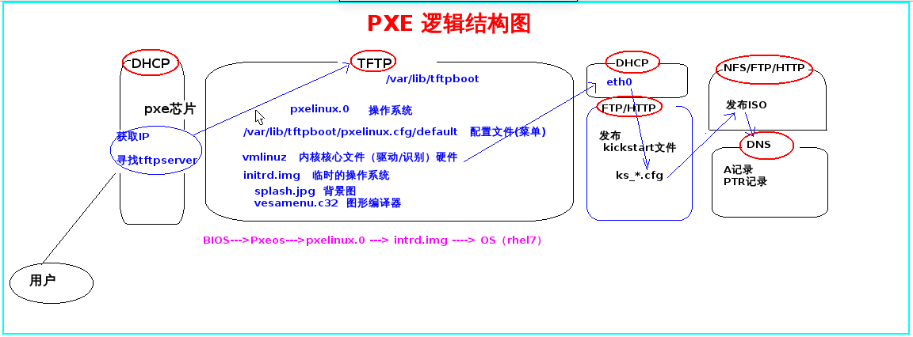

# 网络无人值守安装#

[TOC]

##实验环境说明


服务器端使用172.16.10.2，dhcp分配IP地址为172.16.10.100-150


## 网络无人值守安装的作用
```
常见的Linux安装方式有光盘安装和U盘安装两种，如果我们有几十台甚至上百台服务器需要统一部署上架，不论是光盘安装还是U盘安装，在生产环境中都需要一台一台的逐个安装，即使你有足够多的光驱并刻录足够多的光盘，你也会发现这是一个既耗时又耗力的苦差事。因此，我们就希望于使用一种可以批量化部署的方案，以此解决减少部署时间和部署负责度的问题。这种方法就是网络无人值守安装方案。

网络无人值守安装就是通过网络启动时推送启动或安装选项，通过匹配被安装服务器的网卡MAC地址段确认安装源和安装方式的一种技术集合，它不是一种技术而是多种技术组合完成的。
```
## 网络无人值守安装的流程简介

1）DHCP：用以分配ip地址

2）预启动施行环境（PXE）：通过网卡引导计算机

3）PXELINUX：提供引导文件及内核等文件

4）kickstart文件：提供安装介质

## kickstart无人值安装-部署过程

- 第一步:关闭防火墙
注意：所有节点关闭selinux与清空防火墙规则
```
[root@servera ~]# echo "/usr/sbin/setenforce 0" >>  /etc/rc.local 
[root@servera ~]# echo "/sbin/iptables -F" >> /etc/rc.local 
[root@servera ~]# chmod +x /etc/rc.d/rc.local
[root@servera ~]# source  /etc/rc.local 
```

- 第二步：配置服务器端网卡
```
[root@servera ~]# vi /etc/sysconfig/network-scripts/ifcfg-eth1
DEVICE=eth1
TYPE=Ethernet
ONBOOT=yes
NM_CONTROLLED=yes
BOOTPROTO=static
IPADDR=172.16.10.2
GATEWAY=172.16.10.254
NETMASK=255.255.255.0
[root@servera ~]# service network restart
[root@servera ~]# vi /etc/sysconfig/network
NETWORKING=yes
HOSTNAME=pxe.luguozi.com

[root@servera ~]# hostname pxe.luguozi.com
[root@servera ~]# echo "172.16.10.2  pxe.luguozi.com pxe" >> /etc/hosts
```
 
 - 第三步:  搭建PXE 
 
 1)  安装DHCP服务
```
[root@pxe ~]# yum -y install dhcp
[root@pxe ~]# cp /usr/share/doc/dhcp-4.2.5/dhcpd.conf.example /etc/dhcp/dhcpd.conf 
cp: overwrite ‘/etc/dhcp/dhcpd.conf’? y
```

```
[root@pxe ~]# cat > /etc/dhcp/dhcpd.conf << EOT
allow booting;
allow bootp;
option domain-name "pxe.luguozi.com";
option domain-name-servers 172.16.10.2;
default-lease-time 600;
max-lease-time 7200;
log-facility local7;

subnet 172.16.10.0 netmask $NET {
  range 172.16.10.100 172.16.10.150;
  option domain-name-servers 172.16.10.2;
  option domain-name "pxe.luguozi.com";
  option routers 172.16.10.254;
  option broadcast-address 172.16.10.255;
  default-lease-time 600;
  max-lease-time 7200;
  next-server 172.16.10.2;
  filename "pxelinux.0";
}
class "foo" {
  match if substring (option vendor-class-identifier, 0, 4) = "SUNW";
}

shared-network 224-29 {
  subnet 10.17.224.0 netmask 255.255.255.0 {
    option routers rtr-224.example.org;
  }
  subnet 10.0.29.0 netmask 255.255.255.0 {
    option routers rtr-29.example.org;
  }
  pool {
    allow members of "foo";
    range 10.17.224.10 10.17.224.250;
  }
  pool {
    deny members of "foo";
    range 10.0.29.10 10.0.29.230;
  }
}
EOT
```

```
[root@pxe ~]# service dhcpd restart
```

 2) 配置tftp服务

```
[root@pxe ~]# yum -y install xinetd tftp-server

[root@pxe ~]# vim /etc/xinetd.d/tftp 
        disable                 = no
```
或者使用如下命令：
```
[root@pxe ~]# sed -i '/disable/c \\tdisable \t \t= no' /etc/xinetd.d/tftp
```

```
[root@pxe ~]# service xinetd start
[root@pxe ~]# chkconfig xinetd on
```

  <1> 下载syslinux包
```
[root@pxe ~]# yum -y install syslinux
[root@pxe ~]# cp /usr/share/syslinux/pxelinux.0 /var/lib/tftpboot/
```

 <2> pxelinux.cfg/default
```
[root@pxe ~]# mkdir /var/lib/tftpboot/pxelinux.cfg
[root@pxe ~]# cd /var/lib/tftpboot/pxelinux.cfg/
[root@pxe pxelinux.cfg]# touch default
```
 <3> 定义default菜单文件(注意每段后面不留空格)
```
[root@pxe pxelinux.cfg]# vim /var/lib/tftpboot/pxelinux.cfg/default 
default vesamenu.c32
timeout 60
display boot.msg
menu background splash.jpg
menu title Welcome to Global Learning Services Setup!

label local
        menu label Boot from ^local drive
        menu default
        localhost 0xffff

label install
        menu label Install rhel6.5
        kernel vmlinuz
        append initrd=initrd.img ks=http://172.16.10.2/myks.cfg
```

 <4> 定义启动的相关文件
 提供iso到本地，并挂载
```
[root@pxe pxelinux.cfg]# ls /yum/isolinux/ -l
total 38193
-r--r--r--. 1 root root     2048 Nov 12  2013 boot.cat
-r--r--r--. 2 root root       84 Nov 12  2013 boot.msg
-r--r--r--. 2 root root      334 Nov 12  2013 grub.conf
-r--r--r--. 2 root root 33383449 Nov 12  2013 initrd.img
-r--r--r--. 2 root root    24576 Nov 12  2013 isolinux.bin
-r--r--r--. 2 root root      954 Nov 12  2013 isolinux.cfg
-r--r--r--. 2 root root   165080 Nov 12  2013 memtest
-r--r--r--. 2 root root  1236005 Nov 12  2013 splash.jpg
-r--r--r--. 1 root root     2215 Nov 12  2013 TRANS.TBL
-r--r--r--. 2 root root   162860 Nov 12  2013 vesamenu.c32
-r-xr-xr-x. 2 root root  4128944 Nov 12  2013 vmlinuz

[root@pxe isolinux]# cd /yum/isolinux/
[root@pxe isolinux]# cp vesamenu.c32 boot.msg vmlinuz initrd.img /var/lib/tftpboot/
```

 3) 配置ks.cfg文件
每次配置前先生成密钥
```
[root@pxe isolinux]#grub-crypt
Password:
Retype password:
$6$FQUhYMJFDIL3wofw$zt7O8dJe.7g6m5QzV/dA5BFp8mmUzgiQyudCVuoVhBN.NegQHP5xdDJX6tY5m60ArqOm81THDGXmSWcxCoFAH1
```

```
[root@pxe ~]# vi ~/ks.cfg
# Kickstart file automatically generated by anaconda.
#version=RHEL
reboot
text
install
url --url="http://172.16.10.2/dvd/"
lang en_US.UTF-8
keyboard us
network --onboot yes --device eth0 --bootproto dhcp --noipv6
rootpw  --iscrypted $6$FQUhYMJFDIL3wofw$zt7O8dJe.7g6m5QzV/dA5BFp8mmUzgiQyudCVuoVhBN.NegQHP5xdDJX6tY5m60ArqOm81THDGXmSWcxCoFAH1
firewall --service=ssh
authconfig --enableshadow --passalgo=sha512
selinux --enforcing
services --disabled="kdump,rhsmcertd" --enabled="network,sshd,rsyslog,ovirt-guest-agent,chronyd"
repo --name="Server-HighAvailability" --baseurl=http://172.16.10.2/dvd/
timezone --utc Asia/Shanghai
bootloader --location=mbr --driveorder=sda --append="crashkernel=auto rhgb quiet"
# The following is the partition information you requested
# Note that any partitions you deleted are not expressed
# here so unless you clear all partitions first, this is
# not guaranteed to work
zerombr
clearpart --all --initlabel
#volgroup VolGroup --pesize=4096 pv.008002
#logvol / --fstype=ext4 --name=lv_root --vgname=VolGroup --grow --size=1024 --maxsize=51200
#logvol swap --name=lv_swap --vgname=VolGroup --grow --size=960 --maxsize=960
part /boot --fstype="ext4" --asprimary --size=200
part swap --asprimary --size=1024
part / --fstype="ext4" --asprimary --size=15360
#part pv.008002 --grow --size=1
firstboot --disable
%packages --nobase
@core
@base
vim
net-tools
wget
%post
rm -fr /etc/yum.repos.d/*
cat > /etc/yum.repos.d/dvd.repo << EOT
> [dvd]
> name=this is pxe's source
> baseurl=http://172.16.10.2/dvd
> enabled=1
> gpgcheck=0
> EOT
echo "lugz88" | passwd --stdin root
yum clean all
yum repolist
# workaround anaconda requirements
wget -O /tmp/optimization.sh http://172.16.10.2/ks_config/optimization.sh &>/dev/null
/bin/sh /tmp/optimization.sh
%end

```

  4)配置开机优化脚本
[root@pxe ~]# touch ～/optimization.sh
>开机优化脚本待补充

  5) 通过httpd服务发布ks文件和optimization.sh文件
```
[root@pxe ~]# yum -y install httpd

[root@pxe ~]# cp ~/ks.cfg /var/www/html/myks.cfg
[root@pxe ~]# chown apache. /var/www/html/myks.cfg 
[root@pxe ~]# ll -d /var/www/html/myks.cfg 
-rw-r--r--. 1 apache apache 1524 Jul 28 03:56 /var/www/html/myks.cfg
[root@pxe ~]# mkdir -p /var/www/html/ks_config/
[root@pxe ~]# cp ～/optimization.sh /var/www/html/ks_config/optimization.sh
[root@pxe ~]# yum -y install elinks
[root@pxe ~]# service restrat httpd
[root@pxe ~]# elinks http://172.16.10.2/myks.cfg
[root@pxe ~]# elinks http://172.16.10.2/ks_config/optimization.sh

```

 6) 发布iso ---> http://172.16.10.2/dvd/
```
[root@pxe ~]# mkdir /var/www/html/dvd
[root@pxe ~]# echo "/dev/cdrom /var/www/html/dvd/ iso9660 loop,ro 0 0" >> /etc/fstab
[root@pxe ~]# mount -a
[root@pxe ~]# setenforce 0
```


++++++++++++++++++++++++++++++++++++++++++++++++++++++++++++++++

##增加一个新的标签安装其他系统?


先在服务器端挂载rhel7 的镜像包。

 1.下载ISO，发布iso镜像
[root@pxe-server ~]# mkdir /var/www/html/rhel7 -p
 ---下载镜像，再挂载
[root@pxe-server ~]# mount -o loop /dev/cdrom1 /var/www/html/rhel7/


2. 定义当前系统的ks文件

[root@pxe-server ~]# vim /var/www/html/rhel7u3_ks.cfg
```
#platform=x86, AMD64, 或 Intel EM64T
#version=DEVEL
# Firewall configuration
firewall --disabled
# Install OS instead of upgrade
install
# Use network installation
url --url="http://172.16.10.2/rhel7"
# Root password
rootpw --iscrypted $1$FPdwR/$Msx86rM493PhuBzOGuHXl/
# System authorization information
auth  --useshadow  --passalgo=sha512
# Use text mode install
text
firstboot --disable
# System keyboard
keyboard us
# System language
lang zh_CN
# SELinux configuration
selinux --disabled
# Installation logging level
logging --level=info
# Reboot after installation
reboot
# System timezone
timezone --isUtc Asia/Shanghai
# Network information
network  --bootproto=dhcp --device=eth0 --onboot=on
# System bootloader configuration
bootloader --append="selinux=0" --location=mbr --md5pass="$1$N2ewR/$2CQjSCZk/bSiBBTbJ/4Wi1"
# Clear the Master Boot Record
zerombr
# Partition clearing information
clearpart --all --initlabel 
# Disk partitioning information
part /boot --fstype="ext4" --size=200
part / --fstype="ext4" --size=20000
part swap --fstype="swap" --size=1024

%pre
clearpart --all
part /boot --fstype ext4 --size=100
part pv.100000 --size=10000
part swap --size=512
volgroup vg --pesize=32768 pv.100000
logvol /home --fstype ext4 --name=lv_home --vgname=vg --size=480
logvol / --fstype ext4 --name=lv_root --vgname=vg --size=8192
%end

%post
rm -fr /etc/yum.repos.d/*
cat > /etc/yum.repos.d/dvd.repo << EOT
[dvd]
name=this's PXE source
baseurl=http://192.168.0.16/rhel6
enabled=1
gpgchec=0
EOT
%end

%packages
@basic-desktop
@chinese-support
@desktop-debugging
@desktop-platform
@development
@fonts
@graphical-admin-tools
@input-methods
@legacy-x
@remote-desktop-clients
@x11
httpd
php
mysql-server
mysql
php-mysql
lftp
ftp
openssh


%end

```

 3 定义内核vmlinuz与临时根文件系统initrd.img
```
[root@pxe-server ~]# mkdir -p /var/lib/tftpboot/rhel7u3
[root@pxe-server ~]# cd /var/www/html/rhel7/
[root@pxe-server ~]# cd isolinux/
[root@pxe-server isolinux] mkdir -p /var/lib/tftpboot/rhel7u3
[root@pxe-server isolinux]# cp vmlinuz initrd.img /var/lib/tftpboot/rhel7u3/
```


 4  定义菜单 标签名
```
[root@pxe-server ~]# vim /var/lib/tftpboot/pxelinux.cfg/default 
label install7
        menu label Install rhel7
        kernel rhel7u3/vmlinuz
        append initrd=rhel7u3/initrd.img ks=http://172.16.10.2/rhel7u3_ks.cfg

```


https://access.redhat.com/documentation/en-US/Red_Hat_Enterprise_Linux/6/html/Installation_Guide/s1-kickstart2-options.html

http://www.zyops.com/autoinstall-kickstart


## kickstart快速准备脚本说明
脚本分几块：
配置基础环境
配置PXE环境
服务批量重启脚本、服务批量关闭脚本
01_bashneed.sh:需要的yum库，需要安装的软件，需要配置的信息等
02_

分为6和7的脚本


