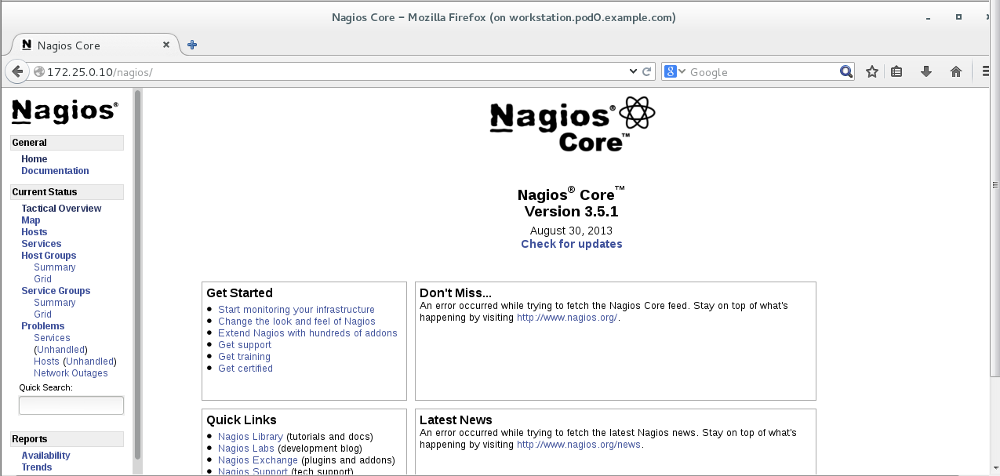
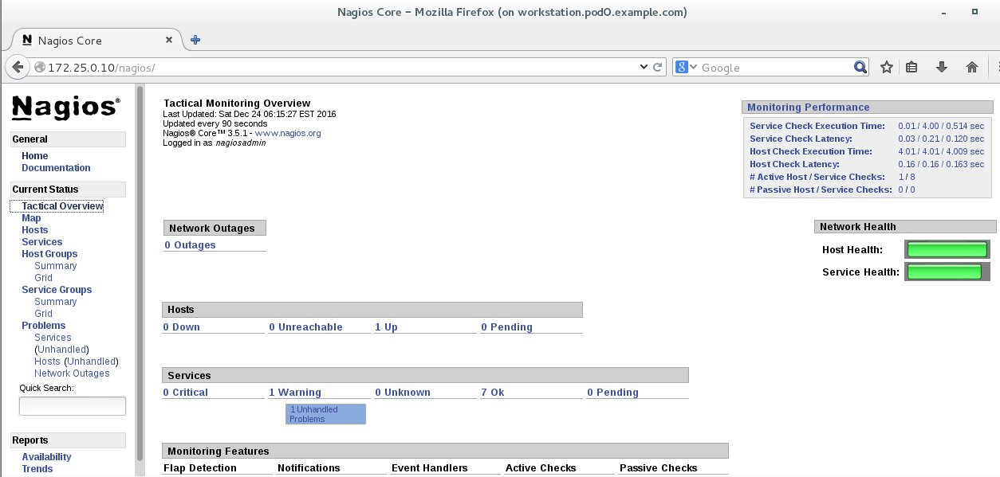
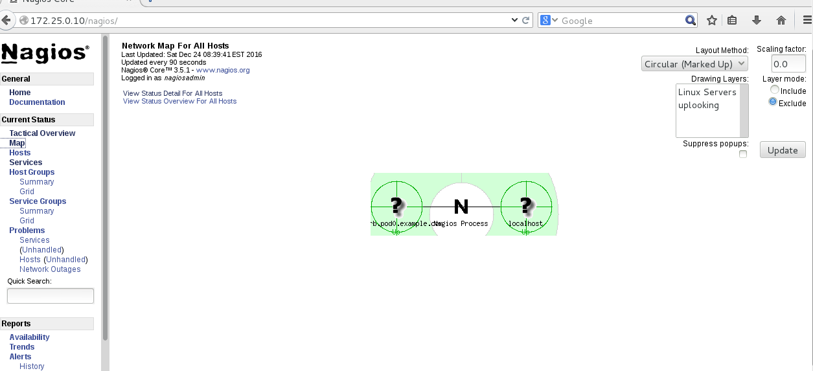
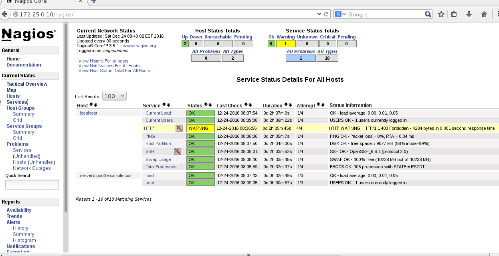

# 监控工具之NAGIOS配置#

[TOC]

## 什么是nagios##

Nagios 是一款开源的免费网络监控报警服务,能有效监控 Windows、Linux 和 Unix 的主机状态以及交换机、路由器和防火墙等网络设置，还有打印机、网络投影、网络摄像等设备。在系统或服务状态异常时发出邮件或其他即时通讯报警，以第一时间通知运维人员。在状态恢复后发出正常的邮件或即时通讯通知。

Nagios 有完善的插件功能，可以方便的根据应用服务扩展功能。

Nagios 可以使用服务-代理(Server-Agent)方式获取主机信息，也可以使用 SNMP 方式获取设备信息。使用服务器-代理(Server-Agent)方式在每个主机上运行代理软件，主机上的代理软件主动提交数据信息，可以避免服务器轮询带来的延迟和非实时性等问题。Nagios 已经可以支持由数万台服务器或上千台网络设备组成的云技术平台的监控，它可以充分发挥自动化运维技术特点在设备和人力资源减少成本。 

Nagios 的缺点在于无法将多个相同应用集群的数据集合起来，也不能监控到集群中特殊节点的迁移和恢复。

## 配置nagios的运行环境##

首先建立一个Nagios的Web主机，用来接受用户的Web访问。这里以servera作为nagios的server端：执行以下操作

```shell
➜  pkg git:(master) pwd
/Users/lmmys/luguozi_GitHub/linux_learning/nagios/pkg
➜  pkg git:(master) scp * root@172.16.250.191:/tmp

[root@localhost tmp]# setenforce 0
[root@localhost tmp]# iptables -F
[root@localhost tmp]# ls *.rpm
fping-3.10-4.el7.x86_64.rpm
nagios-3.5.1-1.el7.x86_64.rpm
nagios-common-3.5.1-1.el7.x86_64.rpm
nagios-devel-3.5.1-1.el7.x86_64.rpm
nagios-plugins-2.0.3-1.el7.x86_64.rpm
nagios-plugins-all-2.0.3-1.el7.x86_64.rpm
nagios-plugins-apt-2.0.3-1.el7.x86_64.rpm
nagios-plugins-bonding-1.4-3.el7.x86_64.rpm
nagios-plugins-breeze-2.0.3-1.el7.x86_64.rpm
nagios-plugins-by_ssh-2.0.3-1.el7.x86_64.rpm
nagios-plugins-check-updates-1.6.9-1.el7.x86_64.rpm
nagios-plugins-cluster-2.0.3-1.el7.x86_64.rpm
nagios-plugins-dbi-2.0.3-1.el7.x86_64.rpm
nagios-plugins-dhcp-2.0.3-1.el7.x86_64.rpm
nagios-plugins-dig-2.0.3-1.el7.x86_64.rpm
nagios-plugins-disk-2.0.3-1.el7.x86_64.rpm
nagios-plugins-disk_smb-2.0.3-1.el7.x86_64.rpm
nagios-plugins-dns-2.0.3-1.el7.x86_64.rpm
nagios-plugins-dummy-2.0.3-1.el7.x86_64.rpm
nagios-plugins-file_age-2.0.3-1.el7.x86_64.rpm
nagios-plugins-flexlm-2.0.3-1.el7.x86_64.rpm
nagios-plugins-fping-2.0.3-1.el7.x86_64.rpm
nagios-plugins-game-2.0.3-1.el7.x86_64.rpm
nagios-plugins-hpjd-2.0.3-1.el7.x86_64.rpm
nagios-plugins-http-2.0.3-1.el7.x86_64.rpm
nagios-plugins-icmp-2.0.3-1.el7.x86_64.rpm
nagios-plugins-ide_smart-2.0.3-1.el7.x86_64.rpm
nagios-plugins-ifoperstatus-2.0.3-1.el7.x86_64.rpm
nagios-plugins-ifstatus-2.0.3-1.el7.x86_64.rpm
nagios-plugins-ircd-2.0.3-1.el7.x86_64.rpm
nagios-plugins-ldap-2.0.3-1.el7.x86_64.rpm
nagios-plugins-load-2.0.3-1.el7.x86_64.rpm
nagios-plugins-log-2.0.3-1.el7.x86_64.rpm
nagios-plugins-mailq-2.0.3-1.el7.x86_64.rpm
nagios-plugins-mrtg-2.0.3-1.el7.x86_64.rpm
nagios-plugins-mrtgtraf-2.0.3-1.el7.x86_64.rpm
nagios-plugins-mysql-2.0.3-1.el7.x86_64.rpm
nagios-plugins-nagios-2.0.3-1.el7.x86_64.rpm
nagios-plugins-nrpe-2.15-2.el7.x86_64.rpm
nagios-plugins-nt-2.0.3-1.el7.x86_64.rpm
nagios-plugins-ntp-2.0.3-1.el7.x86_64.rpm
nagios-plugins-ntp-perl-2.0.3-1.el7.x86_64.rpm
nagios-plugins-nwstat-2.0.3-1.el7.x86_64.rpm
nagios-plugins-openmanage-3.7.12-1.el7.x86_64.rpm
nagios-plugins-oracle-2.0.3-1.el7.x86_64.rpm
nagios-plugins-overcr-2.0.3-1.el7.x86_64.rpm
nagios-plugins-perl-2.0.3-1.el7.x86_64.rpm
nagios-plugins-pgsql-2.0.3-1.el7.x86_64.rpm
nagios-plugins-ping-2.0.3-1.el7.x86_64.rpm
nagios-plugins-procs-2.0.3-1.el7.x86_64.rpm
nagios-plugins-radius-2.0.3-1.el7.x86_64.rpm
nagios-plugins-real-2.0.3-1.el7.x86_64.rpm
nagios-plugins-rpc-2.0.3-1.el7.x86_64.rpm
nagios-plugins-sensors-2.0.3-1.el7.x86_64.rpm
nagios-plugins-smtp-2.0.3-1.el7.x86_64.rpm
nagios-plugins-snmp-2.0.3-1.el7.x86_64.rpm
nagios-plugins-ssh-2.0.3-1.el7.x86_64.rpm
nagios-plugins-swap-2.0.3-1.el7.x86_64.rpm
nagios-plugins-tcp-2.0.3-1.el7.x86_64.rpm
nagios-plugins-time-2.0.3-1.el7.x86_64.rpm
nagios-plugins-ups-2.0.3-1.el7.x86_64.rpm
nagios-plugins-uptime-2.0.3-1.el7.x86_64.rpm
nagios-plugins-users-2.0.3-1.el7.x86_64.rpm
nagios-plugins-wave-2.0.3-1.el7.x86_64.rpm
nrpe-2.15-2.el7.x86_64.rpm
perl-Class-Accessor-0.34-12.el7.noarch.rpm
perl-Config-Tiny-2.14-7.el7.noarch.rpm
perl-Crypt-DES-2.05-20.el7.x86_64.rpm
perl-Math-Calc-Units-1.07-9.el7.noarch.rpm
perl-Nagios-Plugin-0.36-7.el7.noarch.rpm
perl-Net-SNMP-6.0.1-7.el7.noarch.rpm
perl-Readonly-1.03-22.el7.noarch.rpm
perl-Readonly-XS-1.05-15.el7.x86_64.rpm
qstat-2.11-13.20080912svn311.el7.x86_64.rpm
radiusclient-ng-0.5.6-9.el7.x86_64.rpm

[root@localhost tmp]# yum -y localinstall *.rpm


[root@servera conf.d]# vim /etc/httpd/conf.d/nagios.conf 
ScriptAlias /nagios/cgi-bin/ "/usr/lib64/nagios/cgi-bin/"

<Directory "/usr/lib64/nagios/cgi-bin/">
#  SSLRequireSSL
   Options ExecCGI
   AllowOverride None

   AuthName "Nagios Access"
   AuthType Basic
   AuthUserFile /etc/nagios/passwd

   <IfModule mod_authz_core.c>
      # Apache 2.4
      <RequireAll>
         Require all granted
         # Require local
         Require valid-user
      </RequireAll>
 </IfModule>
   <IfModule !mod_authz_core.c>
      # Apache 2.2
      Order allow,deny
      Allow from all
      #  Order deny,allow
      #  Deny from all
      #  Allow from 127.0.0.1
      Require valid-user
   </IfModule>
</Directory>

Alias /nagios "/usr/share/nagios/html"

<Directory "/usr/share/nagios/html">
#  SSLRequireSSL
   Options None
   AllowOverride None

   AuthName "Nagios Access"
   AuthType Basic
   AuthUserFile /etc/nagios/passwd

   <IfModule mod_authz_core.c>
      # Apache 2.4
      <RequireAll>
  Require all granted
         # Require local
         Require valid-user
      </RequireAll>
   </IfModule>
   <IfModule !mod_authz_core.c>
      # Apache 2.2
      Order allow,deny
      Allow from all
      #  Order deny,allow
      #  Deny from all
      #  Allow from 127.0.0.1
      Require valid-user
   </IfModule>
</Directory>
```

我们需要使用 htpasswd 工具设置 /etc/nagios/passwd 文件,用户名是 nagiosadmin，密码我们设置为 uplooking 。

```shell
[root@servera conf.d]# htpasswd -c /etc/nagios/passwd nagiosadmin
New password: 
Re-type new password: 
Adding password for user nagiosadmin
[root@servera conf.d]# cat /etc/nagios/passwd
nagiosadmin:$apr1$YKvTZ4/1$Puhwv8zlVMOJRke9xtJxC/
[root@servera conf.d]# 
```

配置正常后，启动 httpd 和nagios服务，
```shell

[root@servera conf.d]# systemctl restart httpd
[root@servera conf.d]# systemctl restart nagios
```

我们就可以通过浏览器访问 http://servera.podN.example.com/nagios ，也可以使用主机IP访问，比如教师机上使用172.25.0.10访问看到如下图所示了。





若在这里想要看到右边service health处于绿色的状态的话，需要将本地的snmpd服务打开

```shell
[root@servera conf.d]# yum -y install net-snmp net-snmp-utils
[root@servera conf.d]# systemctl restart snmpd
```

## nagios配置文件说明##

### 配置文件结构说明###

#### 服务主目录配置文件说明：####

```shell
[root@servera ~]# cd /etc/nagios/
[root@servera nagios]# ls
cgi.cfg  conf.d  nagios.cfg  nrpe.cfg  objects  passwd  private
```

| 文件         | 说明                                       |
| ---------- | ---------------------------------------- |
| cgi.cfg    | 控制 cgi 访问的配置文件，RPM 安装的 Nagios 的 cgi 文件放置在/usr/lib64/nagios/cgi-bin 目录中。 |
| nagios.cfg | Nagios 的主配置文件，定义了一些文件路径及全局参数。            |
| private 目录 | resouce.cfg 文件叫做资源文件，通过此文件定义一些在其他配置文件中引用的变量比如 $USER1 |
| passwd     | 给 Nagios WEB 登录认证使用的。                    |
| object 目录  | 放置了很多的配置文件模板，用于定义 Nagios 对象。我们配置 Nagios监控及报警就是通过 object 目录下的文件。 |

#### objects目录下的文件说明：####

```shell
[root@servera conf.d]# cd /etc/nagios/objects/
[root@servera objects]# ls
commands.cfg  localhost.cfg  switch.cfg     timeperiods.cfg
contacts.cfg  printer.cfg    templates.cfg  windows.cfg


[root@localhost ~]# cd /usr/lib64/nagios/plugins
[root@localhost plugins]# ls
check_apt       check_ide_smart      check_nt          check_spop
check_breeze    check_ifoperstatus   check_ntp         check_ssh
check_by_ssh    check_ifstatus       check_ntp_peer    check_ssmtp
check_clamd     check_imap           check_ntp.pl      check_swap
check_cluster   check_ircd           check_ntp_time    check_tcp
check_dbi       check_jabber         check_nwstat      check_time
check_dhcp      check_ldap           check_openmanage  check_udp
check_dig       check_ldaps          check_oracle      check_updates
check_disk      check_linux_bonding  check_overcr      check_ups
check_disk_smb  check_load           check_pgsql       check_uptime
check_dns       check_log            check_ping        check_users
check_dummy     check_mailq          check_pop         check_wave
check_file_age  check_mrtg           check_procs       eventhandlers
check_flexlm    check_mrtgtraf       check_radius      negate
check_fping     check_mysql          check_real        urlize
check_ftp       check_mysql_query    check_rpc         utils.pm
check_game      check_nagios         check_sensors     utils.sh
check_hpjd      check_nntp           check_simap
check_http      check_nntps          check_smtp
check_icmp      check_nrpe           check_snmp

```

| 配置文件            | 说明                         |
| --------------- | -------------------------- |
| commands.cfg    | 定义配置文件，在其中定义的命令可以被其他配置文件引用 |
| contacts.cfg    | 定义联系人和联系组的配置文件             |
| localhost.cfg   | 定义监控本地主机的配置文件              |
| printer.cfg     | 定义监控打印机的配置文件，默认没有启用        |
| switch.cfg      | 监控路由器的配置文件，默认没有启用          |
| templates.cfg   | 定义主机、服务的配置文件，可以在其他配置文件中引用  |
| timeperiods.cfg | 定义 nagios 控制时间段的配置文件       |
| windows.cfg     | 控制 windows 主机的配置文件，默认没有启用  |

Nagios 配置需要注意以下四点:

1. 定义监控哪些主机、主机组、服务和服务组。
2. 定义这个监控要用什么命令实现。
3. 定义监控的时间段。
4. 定义主机或服务出现问题时要通知的联系人和联系人组。

nagios 主要用于监控主机资源以及服务,在 nagios 配置中称为对象，为了不必重复定义一些监控对象，Nagios 引入了一个模板配置文件，将一些共性的属性定义成模板，以便于多次引用，这就是 templates.cfg 的作用。

### templates文件说明：###

#### 联系人等相关定义：####

```shell
define contact{
        name                            generic-contact         # 定义该联系信息配置的模板名称
        service_notification_period     24x7                    # 当服务出现异常时，发送通知的时间段，该时间段由timeperiods.cfg文件定义。
        host_notification_period        24x7                    # 当服务出现异常时，发送通知的时间段，该时间段由timeperiods.cfg文件定义。
        service_notification_options    w,u,c,r,f,s             # 这个定义的是“通知可以被发出的情况”。w 即warn,表示警告状态,u 即 unknown,表示不明状态,c 即 criticle,表示紧急状态,r 即 recover,表示恢复状态。也就是在服务出现警告状态、未知状态、紧急状态和重新恢复状态时都发送通知给使用者。
        host_notification_options       d,u,r,f,s               # 定义主机在什么状态下需要发送通知给使用者,d 即down,表示宕机状态,u 即 unreachable,表示不可到达状态,r 即 recovery,表示重新恢复状态。
        service_notification_commands   notify-service-by-email # 服务出现故障，则通过email方式报警，其中“notify-service-by-email”在 commands.cfg 文件中定义。
        host_notification_commands      notify-host-by-email    # 主机出现故障，则通过email方式报警。
        register                        0                       ; DONT REGISTER THIS DEFINITION - ITS NOT A REAL CONTACT, JUST A TEMPLATE!
        }                                                   
```

#### 主机相关定义：####

```shell
define host{
        name                            generic-host    # 主机名称,这里的主机名,并不是直接对应到真正机器的主机名,乃是对应到在主机配置文件里所设定的主机名。
        notifications_enabled           1               
        event_handler_enabled           1               
        flap_detection_enabled          1               
        failure_prediction_enabled      1               
        process_perf_data               1               
        retain_status_information       1              
        retain_nonstatus_information    1              
        notification_period             24x7           # 定义发送通知时间段
        register                        0              
        }
        
define host{
        name                            linux-server    # 主机名称
        use                             generic-host    # use 表示引用,也就是将主机 generic-host 的所有属性引用到 linux-server 中来,在 nagios 配置中,很多情况下会用到引用。
        check_period                    24x7            # 这里的 check_period 告诉 nagios 检查主机的时间段
        check_interval                  5               # nagios 对主机的检查时间间隔,这里是 5 分钟
        retry_interval                  1               # 重试检查时间间隔，单位是分钟
        max_check_attempts              10              # nagios 对主机的最大检查次数，也就是 nagios 在检查发现某主机异常时，并不马上判断为异常状况，而是多试几次，因为有可能只是一时网络太拥挤，或是一些其他原因,让主机受到了一点影响,这里的 10 就是最多试 10 次的意思。
        check_command                   check-host-alive # 指定检查主机状态的命令，其中“check-host-alive”在 commands.cfg 文件中定义。
        notification_period             workhours       # 主机故障时，发送通知的时间范围，其中“workhours”在 timeperiods.cfg 中进行了定义。
        notification_interval           120             # 在主机出现异常后,故障一直没有解决,nagios 再次对使用者发出通知的时间。单位是分钟。如果你觉得,所有的事件只需要一次通知就够了,可以把这里的选项设为 0
        notification_options            d,u,r         # 定义主机在什么状态下可以发送通知给使用者,d 即down,表示宕机状态,u 即 unreachable,表示不可到达状态,r 即recovery,表示重新恢复状态。
        contact_groups                  admins        # 指定联系人组,这个“admins”在 contacts.cfg 文件中定义
        register                        0              
        }

```

#### 服务相关定义：####

```shell
define service{
        name                            generic-service        # 定义一个服务名称
        active_checks_enabled           1                       
        passive_checks_enabled          1                      
        parallelize_check               1                    
        obsess_over_service             1                       
        check_freshness                 0                       
        notifications_enabled           1                       
        event_handler_enabled           1                      
        flap_detection_enabled          1                      
        failure_prediction_enabled      1                       
        process_perf_data               1                      
        retain_status_information       1                       
        retain_nonstatus_information    1                      
        is_volatile                     0                      
        check_period                    24x7         # 定义检查时间段           
        max_check_attempts              3            # 定义对nagios对服务的最大检查次数
        normal_check_interval           10           # 定义检查服务的时间间隔，单位是分钟          
        retry_check_interval            2            # 定义重试检查时间间隔，单位是分钟           
        contact_groups                  admins       # 定义联系人组          
        notification_options            w,u,c,r      # 这个定义的是“通知可以被发出的情况”。w 即 warn，表示警告状态，u 即 unknown,表示不明状态，c 即 criticle,表示紧急状态，r 即 recover,表示恢复状态。也就是在服务出现警告状态、未知状态、紧急状态和重新恢复后都发送通知给使用者。
        notification_interval           60           # 在服务出现异常后,故障一直没有解决,nagios 再次对使用者发出通知的时间。单位是分钟。0代表只发送一次。
        notification_period             24x7         # 指定“发送通知”的时间段。
         register                        0                     
        }

```

### nagios宏的说明###

Nagios 配置非常灵活，继承和引用是一大特征，另一个重要特征就是可以在命令行的定义里使用宏，通过定义宏 nagios 可以灵活的获取主机、服务和其它对象的信息。
在执行命令之前，nagios 将对命令里的每个宏替换成它们应当取得的值。这种宏替换发生在 Nagios 执行各种类型的宏时候。例如主机和服务的检测、通知、事件处理等。

宏的分类：默认宏、按需而成的宏、用户自定制宏等。

默认宏：主机 IP 地址宏。当在命令定义中使用主机或服务宏时，宏将要执行所用的值指向主机或服务所带有值。

Nagios 可用的全部的宏

| 宏类型  | 宏名称                 | 说明                                     |
| ---- | ------------------- | -------------------------------------- |
| 主机宏  | \$HOSTNAME$         | 主机简称 ( 如 "web") ，取自于主机定义里的 host_name 域 |
|      | \$HOSTADDRESS$      | 主机地址，取自于主机定义里的 address 域               |
| 服务宏  | \$SERVICESTATE$     | 服务状态描述,有 w , u , c                     |
|      | \$SERVICEDESC$      | 对当前服务的描述                               |
| 联系人宏 | \$CONTACTNAME$      | 表示联系人，在联系人文件中定义                        |
| 通知宏  | \$NOTIFICATIONTYPE$ | 返回一系列通知信息                              |
| 时间宏  | \$longdatetime$     | 显示当前日期、                                |
| 文件宏  | \$logfile$          | 日志文件保存位置                               |
|      | \$mainconfigfile$   | 主配置文件保存位置                              |
| 其他宏  | \$adminemail$       | 全局的管理员email地址                          |
|      | \$argn$             | 指向第n个命令传递参数，nagios最多支持32个参数宏           |

### commands.cfg文件说明###

commands.cfg 文件默认是存在的，无需修改即可使用，当然如果有新的命令需要加入时，在此文件进行添加即可。这里并未列出文件的所有内容，仅仅介绍了配置中用到的一些命令。

```shell
[root@servera objects]# vim commands.cfg 
define command{
        command_name    check_local_procs  # 命令的名称
        command_line    $USER1$/check_procs -w $ARG1$ -c $ARG2$ -s $ARG3$  # 实际执行命令的效果
        }                
# 这里的变量$USER1$在/etc/nagios/private/resource.cfg文件中进行定义，$USER1$=/usr/lib64/nagios/plugins，那么 check_procs为/usr/lib64/nagios/plugins/check_procs。
# -w 说明后面的一对值对应的是“WARNING”状态，-c说明后面的一对值对应的是“CRITICAL”。
# 这里的-s代表的是状态的意思，可以通过执行check_procs获取对应的一些帮助信息。
# ARG代表传递进来的参数
```

### localhost.cfg配置文件说明###

localhost.cfg是用来定义本地主机相关的配置。

```shell
[root@servera objects]# vim localhost.cfg 
define host{  # 定义主机相关
        use                     linux-server          # 定义模板里配置的linux-server 的属性信息             
        host_name               localhost             # 定义主机名
        alias                   localhost             # 定义别名
        address                 127.0.0.1             # 定义主机ip
        }

define hostgroup{   # 定义主机组相关
        hostgroup_name  linux-servers      # 主机组名
        alias           Linux Servers      # 主机组别名
        members         localhost          # 主机组成员包含的主机名，以逗号分隔可以写多个成员
        }
define service{
        use                             local-service         # 引用 local-service 服务的属性值,local-service 在templates.cfg 文件中进行了定义。
        host_name                       localhost    # 指定要监控哪个主机上的服务
        service_description             PING      # 描述信息
        check_command                   check_ping!100.0,20%!500.0,60% # 监控的实际内容
        }

```

### contacts.cfg配置文件的说明###

contacts.cfg 是一个定义联系人和联系人组的配置文件。当监控的主机或者服务出现故障，nagios 会通过指定的通知方式（邮件或者短信）将信息发给这里指定的联系人或者使用者。

```shell
[root@servera objects]# vim contacts.cfg 
define contact{
        contact_name                    nagiosadmin             # 联系人名称
        use                             generic-contact         # 调用模板中generic-contact相关属性
        alias                           Nagios Admin            # 联系人别名

        email                           nagios@localhost       # 联系人邮箱
        }

define contactgroup{
        contactgroup_name       admins                        # 组名
        alias                   Nagios Administrators         # 组的别名
        members                 nagiosadmin                   # 组内成员，以逗号分隔可以写多个
        }

```

### timeperiods.cfg 文件说明

timeperiods.cfg只用于定义监控的时间段，下面是一个配置好的实例：

```shell
[root@servera objects]# vim timeperiods.cfg 
define timeperiod{
        timeperiod_name workhours       # 只定义周一到周五的工作时间
        alias           Normal Work Hours
        monday          09:00-17:00
        tuesday         09:00-17:00
        wednesday       09:00-17:00
        thursday        09:00-17:00
        friday          09:00-17:00
        }
```

## 配置nagios监控远程主机##

在这里，我们被监控的主机为serverb.podN.example.com这台服务器，ip地址为172.25.N.11，实际监控内容可以自行选择，请注意使用你的设备号替换N，讲师机设备号为0。

### 配置被监控主机运行环境###

#### 软件安装####

为了方便配置和监测，我们需要在该服务器上安装 nagios 的客户端和监控内容对应的插件。在该服务器上我们还需要配置 nrpe，让它运行servera的 nagios 访问并且执行命令监测各内容的运行状况。

实际工作中，为保证系统的整洁和安全，一般需要监控监控什么内容，再只安装什么插件。

在我们的实验环境中，可以在classroom服务器下载需要的软件包，然后将其安装。

```shell
[root@localhost tmp]# ls *.rpm
fping-3.10-4.el7.x86_64.rpm
nagios-3.5.1-1.el7.x86_64.rpm
nagios-common-3.5.1-1.el7.x86_64.rpm
nagios-devel-3.5.1-1.el7.x86_64.rpm
nagios-plugins-2.0.3-1.el7.x86_64.rpm
nagios-plugins-all-2.0.3-1.el7.x86_64.rpm
nagios-plugins-apt-2.0.3-1.el7.x86_64.rpm
nagios-plugins-bonding-1.4-3.el7.x86_64.rpm
nagios-plugins-breeze-2.0.3-1.el7.x86_64.rpm
nagios-plugins-by_ssh-2.0.3-1.el7.x86_64.rpm
nagios-plugins-check-updates-1.6.9-1.el7.x86_64.rpm
nagios-plugins-cluster-2.0.3-1.el7.x86_64.rpm
nagios-plugins-dbi-2.0.3-1.el7.x86_64.rpm
nagios-plugins-dhcp-2.0.3-1.el7.x86_64.rpm
nagios-plugins-dig-2.0.3-1.el7.x86_64.rpm
nagios-plugins-disk-2.0.3-1.el7.x86_64.rpm
nagios-plugins-disk_smb-2.0.3-1.el7.x86_64.rpm
nagios-plugins-dns-2.0.3-1.el7.x86_64.rpm
nagios-plugins-dummy-2.0.3-1.el7.x86_64.rpm
nagios-plugins-file_age-2.0.3-1.el7.x86_64.rpm
nagios-plugins-flexlm-2.0.3-1.el7.x86_64.rpm
nagios-plugins-fping-2.0.3-1.el7.x86_64.rpm
nagios-plugins-game-2.0.3-1.el7.x86_64.rpm
nagios-plugins-hpjd-2.0.3-1.el7.x86_64.rpm
nagios-plugins-http-2.0.3-1.el7.x86_64.rpm
nagios-plugins-icmp-2.0.3-1.el7.x86_64.rpm
nagios-plugins-ide_smart-2.0.3-1.el7.x86_64.rpm
nagios-plugins-ifoperstatus-2.0.3-1.el7.x86_64.rpm
nagios-plugins-ifstatus-2.0.3-1.el7.x86_64.rpm
nagios-plugins-ircd-2.0.3-1.el7.x86_64.rpm
nagios-plugins-ldap-2.0.3-1.el7.x86_64.rpm
nagios-plugins-load-2.0.3-1.el7.x86_64.rpm
nagios-plugins-log-2.0.3-1.el7.x86_64.rpm
nagios-plugins-mailq-2.0.3-1.el7.x86_64.rpm
nagios-plugins-mrtg-2.0.3-1.el7.x86_64.rpm
nagios-plugins-mrtgtraf-2.0.3-1.el7.x86_64.rpm
nagios-plugins-mysql-2.0.3-1.el7.x86_64.rpm
nagios-plugins-nagios-2.0.3-1.el7.x86_64.rpm
nagios-plugins-nrpe-2.15-2.el7.x86_64.rpm
nagios-plugins-nt-2.0.3-1.el7.x86_64.rpm
nagios-plugins-ntp-2.0.3-1.el7.x86_64.rpm
nagios-plugins-ntp-perl-2.0.3-1.el7.x86_64.rpm
nagios-plugins-nwstat-2.0.3-1.el7.x86_64.rpm
nagios-plugins-openmanage-3.7.12-1.el7.x86_64.rpm
nagios-plugins-oracle-2.0.3-1.el7.x86_64.rpm
nagios-plugins-overcr-2.0.3-1.el7.x86_64.rpm
nagios-plugins-perl-2.0.3-1.el7.x86_64.rpm
nagios-plugins-pgsql-2.0.3-1.el7.x86_64.rpm
nagios-plugins-ping-2.0.3-1.el7.x86_64.rpm
nagios-plugins-procs-2.0.3-1.el7.x86_64.rpm
nagios-plugins-radius-2.0.3-1.el7.x86_64.rpm
nagios-plugins-real-2.0.3-1.el7.x86_64.rpm
nagios-plugins-rpc-2.0.3-1.el7.x86_64.rpm
nagios-plugins-sensors-2.0.3-1.el7.x86_64.rpm
nagios-plugins-smtp-2.0.3-1.el7.x86_64.rpm
nagios-plugins-snmp-2.0.3-1.el7.x86_64.rpm
nagios-plugins-ssh-2.0.3-1.el7.x86_64.rpm
nagios-plugins-swap-2.0.3-1.el7.x86_64.rpm
nagios-plugins-tcp-2.0.3-1.el7.x86_64.rpm
nagios-plugins-time-2.0.3-1.el7.x86_64.rpm
nagios-plugins-ups-2.0.3-1.el7.x86_64.rpm
nagios-plugins-uptime-2.0.3-1.el7.x86_64.rpm
nagios-plugins-users-2.0.3-1.el7.x86_64.rpm
nagios-plugins-wave-2.0.3-1.el7.x86_64.rpm
nrpe-2.15-2.el7.x86_64.rpm
perl-Class-Accessor-0.34-12.el7.noarch.rpm
perl-Config-Tiny-2.14-7.el7.noarch.rpm
perl-Crypt-DES-2.05-20.el7.x86_64.rpm
perl-Math-Calc-Units-1.07-9.el7.noarch.rpm
perl-Nagios-Plugin-0.36-7.el7.noarch.rpm
perl-Net-SNMP-6.0.1-7.el7.noarch.rpm
perl-Readonly-1.03-22.el7.noarch.rpm
perl-Readonly-XS-1.05-15.el7.x86_64.rpm
qstat-2.11-13.20080912svn311.el7.x86_64.rpm
radiusclient-ng-0.5.6-9.el7.x86_64.rpm


[root@localhost tmp]# yum -y localinstall *.rpm
[root@localhost tmp]# yum -y install gcc xinetd
[root@localhost tmp]# tar xzvf nrpe-2.12.tar.gz
[root@localhost tmp]# cd nrpe-2.12
[root@localhost nrpe-2.12]# ./configure
checking for SSL headers... configure: error: Cannot find ssl headers
find ssl headers原因是缺少openssl-devel包，yum -y install openssl-devel

[root@localhost nrpe-2.12]# yum -y install openssl-devel
[root@localhost nrpe-2.12]# ./configure
[root@serverb nrpe-2.12]# make all
[root@serverb nrpe-2.12]# make install-plugin
[root@serverb nrpe-2.12]# make install-daemon
[root@serverb nrpe-2.12]# make install-daemon-config
[root@serverb nrpe-2.12]# make install-xinetd
[root@serverb nrpe-2.12]# vim /etc/xinetd.d/nrpe 
        only_from       = 127.0.0.1 172.25.1.10

[root@serverb nrpe-2.12]# vim /etc/services 
nrpe            5666/tcp                # nrpe


[root@serverb ~]# vim /usr/local/nagios/etc/nrpe.cfg
command[check_uu]=/usr/lib64/nagios/plugins/check_users -w 5 -c 10
command[check_ll]=/usr/lib64/nagios/plugins/check_load -w 15,10,5 -c 30,25,20
command[check_root]=/usr/lib64/nagios/plugins/check_disk -w 20% -c 10% -p /
command[check_zombie_procs]=/usr/lib64/nagios/plugins/check_procs -w 5 -c 10 -s Z
command[check_total_procs]=/usr/lib64/nagios/plugins/check_procs -w 150 -c 200 
command[check_haha]=/usr/lib64/nagios/plugins/check_swap -w 20% -c 10%

[root@serverb ~]# systemctl restart  xinetd
[root@serverb ~]# netstat -tnlp |grep :5666
tcp        0      0 0.0.0.0:5666            0.0.0.0:*               LISTEN      2330/nrpe           
tcp6       0      0 :::5666                 :::*                    LISTEN      2330/nrpe

本地检测:
[root@serverb nrpe-2.12]# /usr/local/nagios/libexec/check_nrpe -H localhost
[root@serverb nrpe-2.12]# hostname serverb.pod1.example.com
[root@serverb nrpe-2.12]# vi /etc/hostname
[root@serverb nrpe-2.12]# cat /etc/hostname
serverb.pod1.example.com


```


#### NRPE 
NRPE是Nagios的一个功能扩展，它可在远程Linux/Unix主机上执行插件程序。通过在远程服务器上安装NRPE插件及Nagios插件程序来向Nagios监控平台提供该服务器的本地情况，如CPU负载，内存使用，磁盘使用等。我们将Nagios监控端称为Nagios服务器端，而将远程被监控的主机称为Nagios客户端。

Nagios监控远程主机的方法有多种，其方式包括SNMP、NRPE、SSH、NCSA等。Nagios官方推荐监控主机使用NRPE方式，而监控设备使用SNMP方式。

NRPE（Nagios Remote Plugin Executor）是用于在远端服务器上运行监测命令的守护进程，它用于让Nagios监控端基于安装的方式触发远端主机上的检测命令，并将检测结果返回给监控端。而其执行的开销远低于基于SSH的检测方式，而且检测过程不需要远程主机上的系统账号信息，其安全性也高于SSH的检测方式。

#### 编辑nrpe配置文件####

```shell
[root@serverb nagios]# vim /etc/nagios/nrpe.cfg 
allowed_hosts=127.0.0.1, 172.25.0.10  # 定义监控主机的ip地址
command[check_users]=/usr/lib64/nagios/plugins/check_users -w 5 -c 10  
command[check_load]=/usr/lib64/nagios/plugins/check_load -w 15,10,5 -c 30,25,20
command[check_hda1]=/usr/lib64/nagios/plugins/check_disk -w 20% -c 10% -p /dev/hda1
command[check_zombie_procs]=/usr/lib64/nagios/plugins/check_procs -w 5 -c 10 -s Z
command[check_total_procs]=/usr/lib64/nagios/plugins/check_procs -w 150 -c 200 
# 以上为定义命令的方式，默认已配好一部分命令的定义，也可以自己调用插件来完成相关定义
```

#### 启动nrpe服务####

```shell
[root@serverb nagios]# systemctl restart nrpe
```

### 配置监控主机的相关内容###

先在主配置文件里增加一个条目，定义serverb.conf该配置文件专门用来定义serverb的监控实例：

```shell
[root@servera objects]# vim /etc/nagios/nagios.cfg 
cfg_file=/etc/nagios/objects/serverb.cfg
```

编写serverb.conf的相关内容：

```shell
[root@servera objects]# vim serverb.cfg 
# 定义主机
define host{
        use                     linux-server                                                         
        host_name               serverb.pod0.example.com
        alias                   serverb
        address                 172.25.0.11
        }
# 定义主机组
define hostgroup{
        hostgroup_name  uplooking-servers 
        alias           uplooking 
        members         serverb.pod0.example.com     
        }
# 定义命令
define command{
        command_name check_nrpe
        command_line $USER1$/check_nrpe -H $HOSTADDRESS$ -c $ARG1$
}
# 定义监控服务
define service{
        use generic-service
        host_name serverb.pod0.example.com
        service_description load
        check_command check_nrpe!check_load
}
define service{
        use generic-service
        host_name serverb.pod0.example.com
        service_description user
        check_command check_nrpe!check_users
}

```

先运行nagios指令查看一下配置文件是否有误，根据报错修改配置参数：

```shell
[root@servera objects]# nagios -v /etc/nagios/nagios.cfg 

Nagios Core 3.5.1
Copyright (c) 2009-2011 Nagios Core Development Team and Community Contributors
Copyright (c) 1999-2009 Ethan Galstad
Last Modified: 08-30-2013
License: GPL

Website: http://www.nagios.org
Reading configuration data...
   Read main config file okay...
Processing object config file '/etc/nagios/objects/commands.cfg'...
Processing object config file '/etc/nagios/objects/contacts.cfg'...
Processing object config file '/etc/nagios/objects/timeperiods.cfg'...
Processing object config file '/etc/nagios/objects/templates.cfg'...
Processing object config file '/etc/nagios/objects/localhost.cfg'...
Processing object config file '/etc/nagios/objects/serverb.cfg'...
Processing object config directory '/etc/nagios/conf.d'...
   Read object config files okay...

Running pre-flight check on configuration data...

Checking services...
    Checked 10 services.
Checking hosts...
    Checked 2 hosts.
Checking host groups...
    Checked 2 host groups.
Checking service groups...
    Checked 0 service groups.
Checking contacts...
    Checked 1 contacts.
Checking contact groups...
    Checked 1 contact groups.
Checking service escalations...
    Checked 0 service escalations.
Checking service dependencies...
    Checked 0 service dependencies.
Checking host escalations...
    Checked 0 host escalations.
Checking host dependencies...
    Checked 0 host dependencies.
Checking commands...
    Checked 25 commands.
Checking time periods...
    Checked 5 time periods.
Checking for circular paths between hosts...
Checking for circular host and service dependencies...
Checking global event handlers...
Checking obsessive compulsive processor commands...
Checking misc settings...

Total Warnings: 0
Total Errors:   0

Things look okay - No serious problems were detected during the pre-flight check

```

```
[root@localhost objects]# /usr/lib64/nagios/plugins/check_nrpe -H 172.16.250.216
NRPE v2.12

[root@servera ~]#  /usr/lib64/nagios/plugins/check_nrpe -H 172.25.1.11 -c check_haha
SWAP OK - 100% free (10238 MB out of 10238 MB) |swap=10238MB;2047;1023;0;10238

```


确认配置文件无误后，重启nagios服务

```shell
[root@servera objects]# systemctl restart nagios
```

访问测试：

浏览器访问 http://172.25.0.10/nagios，输入用户名 nagiosadmin，密码uplooking 。点击 map ，我们可以看到类似下图的结构。




然后点击services，查看对应主机监控内容是否ok，如果处于pending的状态，则稍等片刻查看数据结果：



更多的配置和使用方法请大家查看官方文档继续学习。

www.nagios.org/about/ 
https://assets.nagios.com/downloads/nagioscore/docs/nagioscore/4/en/quickstart.html
https://library.nagios.com/library/products/nagios-core/manuals//

