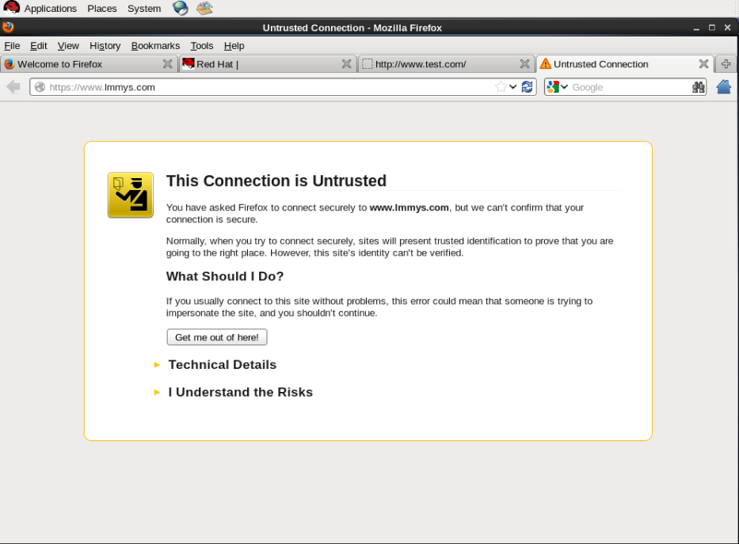
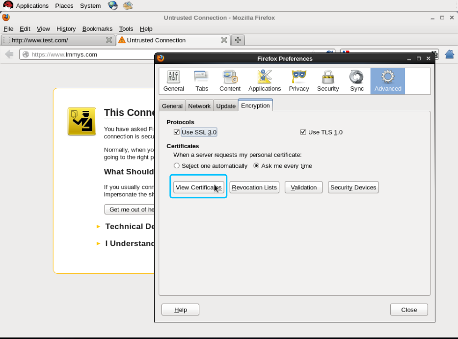
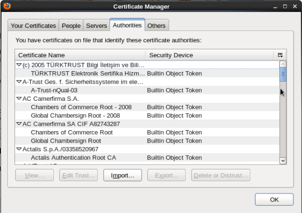
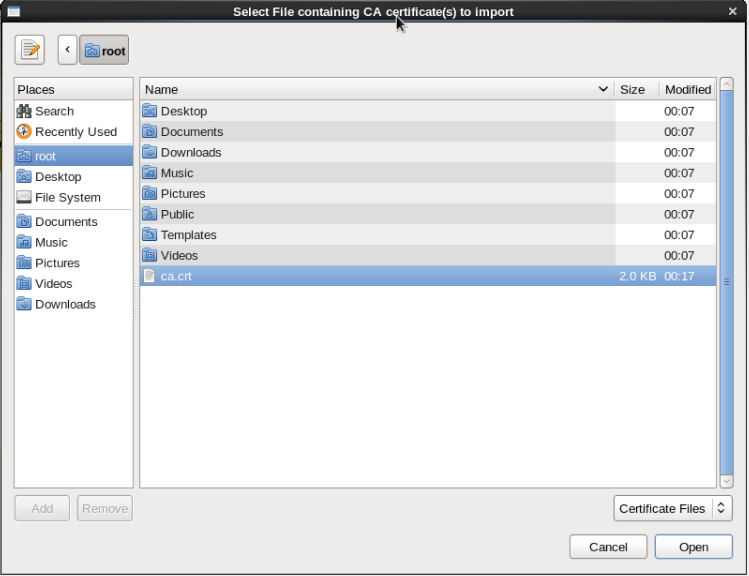
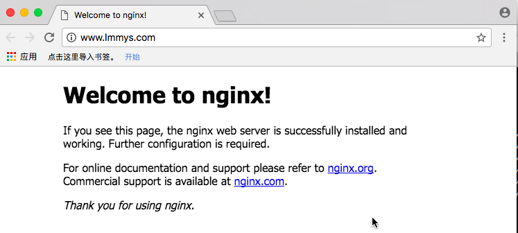
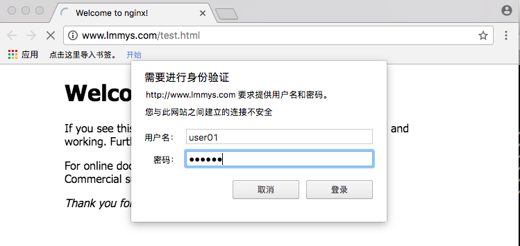

[TOC]

# nginx（上篇）#

---


### web服务器简介###

WEB 服务器也称为WWW(WORLD WIDE WEB)服务器，主要功能是提供网上信息浏览服务。在Internet 网络环境中，Web 服务无疑是最为流行的应用系统之一，有了web 站点，于企业而言，可以充分展示自己的产品，宣传企业形象，提供与客户交流、电子商务交易的平台等丰富的网络资源，已经成为很多人在网上查找、浏览信息的主要手段。于用户而言，用户可以通过简单的图形界面就可以访问各个大学、组织、公司等的最新信息和各种服务。如果你有条件，你可以注册一个域名，申请一个IP 地址，然后让你的ISP 将这个IP 地址解析到你的LINUX 主机上。然后，在LINUX 主机上架设一个WEB 服务器。你就可以将主页存放在这个自己的WEB 服务器上，通过它把自己的主页向外发布。

常用web服务器如下：

Unix 和Linux 平台下的常用Web 服务器有Apache、Nginx、Lighttpd、Tomcat、IBM WebSphere 等。目前应
用最广泛的Web 服务器是Apache。Windows 平台下最常用的服务器则是微软公司的IIS(Internet Information Server)。
**1.apache**

Apache 起初由Illinois 大学Urbana-Champaign 的国家高级计算程序中心开发。此后Apache 被开放源代码团体成员不断的发展和加强。1996 年4 月以来，Apache 一直是Internet 上最流行的HTTP 服务器，1999 年5 月它在57% 的网页服务器上运行，到了2005 年7 月这个比例上升到69%。Apache 是目前世界上用的最多的Web 服务器。
优势：

（1）开放源代码

（2）支持跨平台的应用(可以运行在几乎所有的Unix、Linux、Windows 系统平台之上)
（3）支持各种网络编程语言，如php，python，甚至微软的ASP 技术也能在apache 服务器中使用。
（4）模块化设计，使之具有良好的扩展性
（5）运行稳定，安全性好
Apache 的官方网站: http://www.apache.org
**2.lighttpd**

Lighttpd 是一个德国人领导的开源软件，其根本的目的是提供一个专门针对高性能网站。Lighttpd 是众多OpenSource轻量级的Web server 中较为优秀的一个。支持FastCGI, CGI, Auth, 输出压缩(output compress), URL 重写, Alias 等重要功能，而Apache 之所以流行，很大程度也是因为功能丰富，在Lighttpd 上很多功能都有相应的实现了，这点对于Apache 的用户是非常重要的，因为迁移到Lighttpd 就必须面对这些问题。
优势：

（1）内存消耗低
（2）安全性高
（3）兼容性好
（4）运行速度快
Lighttpd 的官方网站: http://www.lighttpd.net
**3.tomcat**

Tomcat 是一个免费的开源的Serlvet 容器，它是Apache 基金会的Jakarta 项目中的一个核心项目，由Apache、Sun和其它一些公司及个人共同开发而成。由于有了Sun 的参与和支持，最新的Servlet 和Jsp 规范总能在Tomcat 中得到体现。Tomcat 即是一个Jsp 和Servlet 的运行平台。同时Tomcat 又不仅仅是一个Servlet 容器，它也具有传统的Web 服务器的功能：处理Html 页面，但是与Apache 相比，它的处理静态Html 的能力就不如Apache，我们可以将Tomcat 和Apache 集成到一块，让Apache 处理静态Html，而Tomcat 处理Jsp 和Servlet。这种集成只需要修改一下Apache 和Tomcat 的配置文件即可。
Tomcat 的官方网站: http://tomcat.apache.org
**4.WebSphere Application Server**

WebSphere Application Server 是一种功能完善、开放的Web 应用程序服务器，是IBM 电子商务计划的核心部分。
基于Java 和Servlets 的Web 应用程序运行环境，包含了为Web 站点提供服务所需的一切，运行时可以协同并扩展
Apache、Netscape、IIS 和IBM 的HTTPWeb 服务器，因此可以成为强大的Web 应用服务器。
WebSphere 的官方网站: http://www.ibm.com
**5.IIS**

IIS 是Internet Information Server 的缩写，它是微软公司主推的服务器。IIS 与Window NT Server 完全集成在一起，因而用户能够利用Windows NT Server 和NTFS（NT File System，NT 的文件系统）内置的安全特性，建立强大，灵活而安全的Internet 和Intranet 站点。IIS 支持HTTP（Hypertext Transfer Protocol，超文本传输协议），FTP（File TransferProtocol，文件传输协议）以及SMTP 协议，通过使用CGI 和ISAPI，IIS 可以得到高度的扩展。
IIS 的官方网站: http://www.iis.net
**6.nginx**

Nginx 是俄罗斯人编写的十分轻量级的HTTP 服务器,Nginx，它的发音为“engine X”， 是一个高性能的HTTP 和反向代理服务器，同时也是一个IMAP/POP3/SMTP 代理服务器。Nginx 是由俄罗斯人Igor Sysoev 为俄罗斯访问量第二的Rambler.ru 站点开发的，它已经在该站点运行超过两年半了。Igor Sysoev 在建立的项目时，使用基于BSD 许可。自Nginx 发布四年来，Nginx 已经因为它的稳定性、丰富的功能集、示例配置文件和低系统资源的消耗而闻名。在俄罗斯许多大网站都已经使用它， 且一直表现不凡。截至2007 年4 月，俄罗斯大约有20%左右的虚拟主机是由nignx服务或代理的。Google 在线安全博客中统计Nginx 服务或代理了大约所有Internet 虚拟主机的4%。而Netcraft 的统计显示，Nginx 服务的主机在过去的一年里以四倍的速度增长并且在这几年里，它的排名还在不断上升。

---

### NGINX的优势

（1）Nginx 性能强大。专为性能优化而开发，性能是其最重要的考量,实现上非常注重效率。它支持内核Poll 模型，能
经受高负载的考验,有报告表明能支持高达50,000 个并发连接数。
（2）Nginx 稳定性高。其它HTTP 服务器当遇到访问的峰值，或者有人恶意发起慢速连接时，也很可能会导致服务器物
理内存耗尽频繁交换，失去响应只能重启服务器。例如当前Apache 一旦上到200 个以上进程，web 响应速度就明显非常缓慢了。而Nginx 采取了分阶段资源分配技术，使得它的CPU 与内存占用率非常低。Nginx 官方表示保持10,000 个没有活动的连接，它只占2.5M 内存，所以类似DOS 这样的攻击对Nginx 来说基本上是毫无用处的。就稳定性而言，nginx 比lighttpd 更胜一筹。
（3）Nginx 支持热部署。启动特别容易，并且几乎可以做到7*24 不间断运行，即使运行数个月也不需要重新启动。你还能够在不间断服务的情况下，对软件版本进行进行升级。
（4）Nginx 采用master-slave 模型。能够充分利用SMP 的优势，且能够减少工作进程在磁盘I/O 的阻塞延迟。
（5）Nginx 代码质量高。代码很规范，手法成熟， 模块扩展也很容易。
（6）Nginx 采用了一些os 提供的最新特性如对sendfile (Linux2.2+)，accept-filter(FreeBSD4.1+)，TCP_DEFER_ACCEPT (Linux 2.4+)的支持，从而大大提高了性能。
（7）nginx 处理请求是异步非阻塞的，而apache 则是阻塞型的，在高并发下nginx 能保持低资源低消耗高性能。
当然，nginx 还很年轻，多多少少存在一些问题，Nginx 的作者和社区都在一直努力解决，我们有理由相信nginx 将继续
以高速的增长率来分享轻量级HTTP 服务器市场，会有一个更美好的未来。


  成功二次开源 http://tengine.taobao.org/
国内使用最多的是淘宝开发的tengine
---

### nginx的安装###

nginx软件光盘不自带，需要去官网自行下载http://nginx.org/， 自从nginx1.9.5版本之后开始支持http2协议。

目前稳定版nginx1.8的版本，redhat提供的官方的rpm版本为1.6。

安装可以通过源码安装，也可以通过配置yum源进行在线安装，也可以下载rpm包进行本地安装。

注意：由于apache和nginx同时会监听80端口，故开启nginx前，先将apache关闭。

```
[root@servera ~]# setenforce 0
[root@servera ~]# iptables -F
[root@localhost tmp]# sed -i '/^SELINUX/c SELINUX=disabled' /etc/selinux/config

[root@localhost tmp]# yum localinstall -y nginx-1.8.0-1.el7.ngx.x86_64.rpm

```

Please find the official documentation for nginx here:
* http://nginx.org/en/docs/

Commercial subscriptions for nginx are available on:
* http://nginx.com/products

  ​
  软件结构如下：

````shell
[root@servera ~]# rpm -ql nginx
/etc/logrotate.d/nginx  --日志轮询
/etc/nginx 
/etc/nginx/conf.d  --子配置文件
/etc/nginx/conf.d/default.conf  
/etc/nginx/conf.d/example_ssl.conf
/etc/nginx/fastcgi_params  --内置变量
/etc/nginx/koi-utf  --俄国语言编码
/etc/nginx/koi-win
/etc/nginx/mime.types  --nginx识别的类型文件
/etc/nginx/nginx.conf  --主配置文件
/etc/nginx/scgi_params
/etc/nginx/uwsgi_params
/etc/nginx/win-utf
/etc/sysconfig/nginx 
/usr/lib/systemd/system/nginx.service  --启动脚本
/usr/libexec/initscripts/legacy-actions/nginx
/usr/libexec/initscripts/legacy-actions/nginx/upgrade
/usr/sbin/nginx  --二进制命令
/usr/share/nginx  --数据目录
/usr/share/nginx/html  --html页面加目录
/usr/share/nginx/html/50x.html  --错误代码
/usr/share/nginx/html/index.html
/var/cache/nginx
/var/log/nginx

````

nginx的启动：

````shell
[root@servera nginx-rpms]# systemctl start nginx
[root@servera nginx-rpms]# ps -ef | grep nginx
root       1438      1  0 10:14 ?        00:00:00 nginx: master process /usr/sbin/nginx -c /etc/nginx/nginx.conf
nginx      1439   1438  0 10:14 ?        00:00:00 nginx: worker process
root       1441   1374  0 10:14 pts/0    00:00:00 grep --color=auto nginx
````


### nginx的基本配置

**1.主配置文件泛读 /etc/nginx/nginx.conf**

````shell
user  nginx;      
worker_processes  1;  #开启nginx的进程数

error_log  /var/log/nginx/error.log warn;  #错误日志
pid        /var/run/nginx.pid;  #进程文件


events {
    worker_connections  1024;  #每个进程数可支持的最大连接数
}
http {
    include       /etc/nginx/mime.types;   #文件扩展名与文件类型映射表
    default_type  application/octet-stream; # 默认文件类型

    log_format  main  '$remote_addr - $remote_user [$time_local] "$request" '   #对于maim日志类型记录
                      '$status $body_bytes_sent "$http_referer" '
                      '"$http_user_agent" "$http_x_forwarded_for"';
            
    access_log  /var/log/nginx/access.log  main;  #常规访问日志

    sendfile        on;   #开启高效文件传输模式
    tcp_nopush     on; #

    keepalive_timeout  65;  #保持连接超时时间

    gzip  on; 

    include /etc/nginx/conf.d/*.conf; #读取/etc/nginx/conf.d目录下以.conf结尾的扩展配置文件
}

````

**2.nginx进程管理**

进程是系统进行资源分配和调度的常见单位，在面向进程设计的程序中，进程是程序的基本执行实体，程序使用进程处理用户请求，进程是内存独享的，运行稳定，处理速度较快，但是资源占用比较大。
进程是线程的容器，也就是进程去开辟地址空间，线程去处理用户请求，在面向线程处理的程序中，线程是基本执行实体线
程是内存共享的，资源占用小，但是稳定性没有进程好。
Apache 在处理用户请求时，有perfork 模式和worker 模式两种，默认使用perfork 模式，即使用进程处理用户请求。

假设，处理一个动态页面需要4M内存，则在进程模式下，处理10个动态页面则需要4*10=40M空间，那么在大并发的情况下，就可能导致内存溢出，从而机器宕机。而在线程模式下，处理10个动态页面则不需要使用到40M的空间，线程是一种内存共享的方式，有一些代码段是可以反复被利用的，也就意味着10个动态页面需要的空间远小于40M，从而支持更大的并发。然而处理请求的方式跑在线程上也可能会发生一些问题，譬如一个线程崩溃了，则可能导致共享代码段受损，结果可能导致数千用户都受到该线程崩溃的影响。

实验：设置nginx 允许开启的进程数量和每个进程允许打开的线程数量

````shell
[root@servera nginx-rpms]# vim /etc/nginx/nginx.conf 
user  nginx;
worker_processes  4;

error_log  /var/log/nginx/error.log warn;
pid        /var/run/nginx.pid;


events {
    worker_connections  2048;
}

[root@servera nginx-rpms]# systemctl restart nginx
[root@servera nginx-rpms]# ps -ef | grep nginx
root       1534      1  0 11:14 ?        00:00:00 nginx: master process /usr/sbin/nginx -c /etc/nginx/nginx.conf
nginx      1535   1534  0 11:14 ?        00:00:00 nginx: worker process
nginx      1536   1534  0 11:14 ?        00:00:00 nginx: worker process
nginx      1537   1534  0 11:14 ?        00:00:00 nginx: worker process
nginx      1538   1534  0 11:14 ?        00:00:00 nginx: worker process
root       1540   1374  0 11:14 pts/0    00:00:00 grep --color=auto nginx

````

**3.nginx下的虚拟主机的配置**

**一：配置基于名称的虚拟主机：**

1）进入/etc/nginx/conf.d/目录，该目录是nginx 虚拟主机配置目录，该目录下有默认有两个文件，default.conf 文件是nginx的默认虚拟主机配置文件，也可作为之后自定义虚拟主机的模板，example_ssl.conf 文件是https 配置的模板文件，后续讲https时会再对该文件做详细说明。

2）配置自定义虚拟主机www.test.com（下述配置为最基本配置）

````shell
[root@servera conf.d]# vim /etc/nginx/conf.d/test.com.conf 
server {
    listen       80;
    server_name  www.test.com;
        root   /usr/share/nginx/test.com;
        index  index.html index.htm;
}
````

3）创建该虚拟主机网页文件存放目录及首页文件

````shell
[root@servera conf.d]# mkdir -p /usr/share/nginx/test.com
[root@servera conf.d]# echo test > /usr/share/nginx/test.com/index.html
````

4）重启服务

````shell
[root@servera conf.d]# systemctl restart nginx
````

5）登录workstation访问测试

````shell
[root@workstation Desktop]# echo "172.25.0.10 www.test.com" >> /etc/hosts
[root@workstation Desktop]# elinks http://www.test.com -dump
test

````


**二：location匹配字段**

location的匹配字段用来匹配url地址的路径部分。location匹配也可以采用正则表达式，有符号的location 优先级高。

下叙例子则演示了当匹配到/tabc.html这个页面的时候，将网站根目录临时切换到/usr/share/nginx/test.com/abc.html。

````shell

[root@localhost test.com]# vi /etc/nginx/conf.d/test.com.conf
server {
     listen       80;
    server_name  www.test.com;
    charset utf-8;
    access_log  /var/log/nginx/www.test.com.access.log  main;

    location / {
        root   /usr/share/nginx/test.com;
        index  index.html index.htm;
                }
    location ~ ^/abc\.html$ {
        root    /usr/share/nginx/test.com;
        index   index.html index.htm;
                }


   location ~ ^/10086\.html$ {
        root    /usr/share/nginx/test.com;
        index   index.html index.htm;
                }

 }

[root@localhost test.com]# cd /usr/share/nginx/test.com/
[root@localhost test.com]# ls
10086.html  abc.html  index.html
[root@localhost test.com]# cat /usr/share/nginx/test.com/*
10086 is 10086
abc is abc
welcome to test.com
[root@servera html]# systemctl restart nginx

[root@localhost test.com]# elinks http://www.test.com/abc.html -dump
   abc is abc
[root@localhost test.com]# elinks http://www.test.com/10086.html -dump
   10086 is 10086
[root@localhost test.com]#

````

---

### 加密连接https

​   众所周知，我们在互联网上冲浪，一般都是使用的http 协议（超文本传输协议），默认情况下数据是明文传送的，这些数据在传输过程中都可能会被捕获和窃听，因此是不安全的。https 可以说是http 协议的安全版，就是为了满足对安全性要求比较高的用户而设计的。如果您的邮件中有敏感数据，不希望被人窃听；如果您不希望被钓鱼网站盗用帐号信息，如果您希望您在使用邮箱的过程中更安全，那么我们推荐您使用https 安全连接。
​   HTTPS 在HTTP 的基础上加入了SSL 协议，SSL 依靠证书来验证服务器的身份，并为浏览器和服务器之间的通信加密。SSL(Secure Socket Layer 安全套接层)为Netscape 所研发，用以保障在Internet 上数据传输之安全，利用数据加密技术，确保数据在网络上之传输过程中不会被截取及窃听。

数据密码方式常见的有以下两种：
（1）对称加密：采用单钥密码系统的加密方法，同一个密钥可以同时用作信息的加密和解密，这种加密方法称为对称加密，也称为单密钥加密。服务端生成公钥和私钥，服务端将公钥传递给客户端，客户端通过公钥加密自己的数据后传递给服务器。

​   对称加密算法的优点是算法公开、计算量小、加密速度快、加密效率高。

​   对称加密算法的缺点是在数据传送前，发送方和接收方必须商定好秘钥，然后使双方都能保存好秘钥。其次如果一方的秘钥被泄露，那么加密信息也就不安全了。另外，每对用户每次使用对称加密算法时，都需要使用其他人不知道的唯一秘钥，这会使得收、发双方所拥有的钥匙数量巨大，密钥管理成为双方的负担。

（2）非对称加密
​   非对称加密算法需要两个密钥来进行加密和解密，公钥和私钥。还是上述例子，乙方生成一对密钥并将公钥向甲方公开，得到该公钥的甲方使用该密钥对机密信息进行加密后再发送给乙方。乙方再用自己保存的私钥对加密后的信息进行解密。乙方只能用私钥解密由对应的公钥加密后的信息。同样，如果乙要回复加密信息给甲，那么需要甲先公布甲的公钥给乙用于加密，甲自己保存甲的私钥用于解密。在传输过程中，即使攻击者截获了传输的密文，并得到了乙的公钥，也无法破解密文，因为只有乙的私钥才能解密密文。

​   非对称加密与安全性更好，使用一对秘钥，一个用来加密，一个用来解密，而且公钥是公开的，秘钥是自己保存的。

​   非对称加密的缺点是加密和解密花费时间长、速度慢。

**https的配置说明**

   CA机构
   /    \     
 私钥---公钥

设置（购买） CA机构证书
通过CA机构的证书 ，生成网页的密钥对（私钥与公钥[证书]）
环境：serverb作为CA中心，servera作为nginx配置ssl页面的web服务端

（1）servera上创建私钥

````shell
[root@servera html]# cd /etc/nginx/
[root@servera nginx]# mkdir key
[root@servera nginx]# cd key/
[root@servera key]# pwd
/etc/nginx/key
[root@servera key]# openssl genrsa 2048 > servera-web.key
Generating RSA private key, 2048 bit long modulus
............................+++
......................................+++
e is 65537 (0x10001)
````

（2）生成证书颁发请求

````shell
[root@servera key]# openssl req -new -key servera-web.key -out servera-web.csr
You are about to be asked to enter information that will be incorporated
into your certificate request.
What you are about to enter is what is called a Distinguished Name or a DN.
There are quite a few fields but you can leave some blank
For some fields there will be a default value,
If you enter ’·‘, the field will be left blank.
-----
Country Name (2 letter code) [XX]:CN
State or Province Name (full name) []:shanghai
Locality Name (eg, city) [Default City]:shanghai
Organization Name (eg, company) [Default Company Ltd]:carol Company .Ltd
Organizational Unit Name (eg, section) []:www.lmmys.com
Common Name (eg, your name or your server‘s hostname) []:www.lmmys.com
Email Address []:root@lmmys.com

Please enter the following ’extra‘ attributes
to be sent with your certificate request
A challenge password []:
An optional company name []:
[root@servera key]# ls
servera-web.csr  servera-web.key
````

（3）将证书颁发请求提交给CA中心（serverb模拟成CA中心）

````shell
[root@servera key]# scp servera-web.csr 172.25.0.11:~
servera-web.csr                               100% 1082     1.1KB/s   00:00  
````

（4） serverb模拟成CA，执行自签名操作

```shell
[root@serverb ~]# openssl genrsa -des3 -out ca.key 4096
需要配置密码
[root@serverb ~]# openssl req -new -x509 -days 3650 -key ca.key -out ca.crt
Enter pass phrase for ca.key:    # 使用之前设置过的密码
You are about to be asked to enter information that will be incorporated
into your certificate request.
What you are about to enter is what is called a Distinguished Name or a DN.
There are quite a few fields but you can leave some blank
For some fields there will be a default value,
If you enter ‘·’, the field will be left blank.
-----
Country Name (2 letter code) [XX]:CN
State or Province Name (full name) []:shanghai
Locality Name (eg, city) [Default City]:shanghai
Organization Name (eg, company) [Default Company Ltd]:redhat .Ltd
Organizational Unit Name (eg, section) []:www.redhat.com
Common Name (eg, your name or your server‘s hostname) []:www.redhat.com
Email Address []:redhat@redhat.com
[root@serverb ~]# 
```


（5）CA中心针对证书颁发请求创建证书

```shell
[root@serverb ~]# openssl x509 -req -days 365 -in servera-web.csr -CA ca.crt -CAkey ca.key -set_serial 01 -out servera-web.crt
Signature ok
subject=/C=CN/ST=shanghai/L=shanghai/O=lmmys Company .Ltd/OU=www.lmmys.com/CN=www.lmmys.com/emailAddress=root@lmmys.com
Getting CA Private Key
Enter pass phrase for ca.key:
```

（6）证书回传给客户端

```
shell
[root@serverb ~]# scp servera-web.crt 172.25.0.10:/etc/nginx/key
The authenticity of host ‘172.25.0.10 (172.25.0.10)’can‘t be established.
ECDSA key fingerprint is 6c:49:1a:9c:b8:9c:4c:91:20:f6:7f:9c:da:ef:57:7f.
Are you sure you want to continue connecting (yes/no)? yes
Warning: Permanently added ‘172.25.0.10’ (ECDSA) to the list of known hosts.
root@172.25.0.10’s password: 
servera-web.crt                               100% 1688     1.7KB/s   00:00 
```

（7） ssl的配置

```shell
[root@servera key]# cd /etc/nginx/conf.d/
[root@servera conf.d]# vim www.lmmys.com.conf 
server {
    listen       443 ssl;  # https监听443端口
    server_name  www.lmmys.com; 
    
    charset utf-8;
    access_log  /var/log/nginx/www.lmmys.com.access.log  main;

    ssl_certificate      /etc/nginx/key/servera-web.crt;  #证书存放位置
    ssl_certificate_key  /etc/nginx/key/servera-web.key;  #私钥存放位置

    ssl_session_cache shared:SSL:1m;
    ssl_session_timeout  5m;

    ssl_ciphers  HIGH:!aNULL:!MD5;    
#指出允许的密码，密码指定为openssl支持的格式
    ssl_prefer_server_ciphers   on;
#依赖SSLv3 和TLSv1 协议的服务器密码将优先于客户端密码
    location / {
        root   /usr/share/nginx/lmmys.com;
        index  index.html index.htm;
    }
}

```

（8）创建网站根目录及测试首页

```shell
[root@servera conf.d]# mkdir /usr/share/nginx/lmmys.com
[root@servera conf.d]# echo ssl test > /usr/share/nginx/lmmys.com/index.html
```

（9） 重启服务

```shell
[root@servera conf.d]# systemctl restart nginx
```

（10）测试访问



该信息为此连接不受信任，模拟的CA中心并未纳入浏览器的CA中心列表中。

向浏览器导入CA中心过程如下

1.复制ca中心的crt文件至workstation

```shell
[root@serverb ~]# scp ca.crt  172.25.0.9:/tmp 
```

2.workstation向浏览器导入ca中心

firefox -> 点击preferences，选择advanced标签，进入以下界面



点击view certificates进入以下界面



点击import，选择ca.crt文件，点击open



 


将三个√选上之后，OK点击退出，重新访问测试


----------------------------------------------------------

### nginx的访问控制###
 - 基于帐号密钥认证：
 - 基于IP限制:
 - deny *.txt
 - deny install/

（1）基于帐号密钥认证：
有时我们会有这么一种需求，就是你的网站并不想提供一个公共的访问或者某些页面不希望公开，我们希望的是某些特定的客户端可以访问。那么我们可以在访问时要求进行身份认证，就如给你自己的家门加一把锁，以拒绝那些不速之客。我们在服务课程中学习过apache 的访问控制，对于Nginx 来说同样可以实现，并且整个过程和Apache 非常的相似。

```
[root@servera key]# vim /etc/nginx/conf.d/default.conf 

    location    /test.html {
        root    /usr/share/nginx/html;
        index  index.html index.htm;
        auth_basic "info"; # 提示信息
        auth_basic_user_file /usr/share/nginx/passwd.db; #存放用户名和密码的文件
    }

```
配置密码
```
[root@servera key]# yum -y install httpd-tools
[root@servera key]# htpasswd -cm /usr/share/nginx/passwd.db user01
New password: 
Re-type new password: 
Adding password for user user01
```
测试
测试登录http://www.lmmys.com,登录成功



测试登录http://www.lmmys.com/test.html，提示需要输入账户密码



输入账户和密码后：


（2）想阻止别人访某些目录下的特定文件，比如不希望别人访问我的”.txt”和”.doc”的文件，那么我们可以通过deny 的方式来做拒绝。

````shell
location ~* .(txt|doc)$ {   
    deny 172.16.250.111;
    deny 172.15.22.0/255.255.255.0
    deny all;
 }
````

此处~* 代表不区分大小写方式匹配。allow代表允许，deny代表不允许。
此处all 代表是客户端的IP，你也可以使用ip/mask 的方式来定义。

也可以设置整个文件夹禁止访问。
其他的请参考相关手册。

-----------------------------------------------

# nginx（中篇)

---

### nignx的rewrite规则###

#### rewrite简介####

​ 所谓rewrite规则，实际指的是地址重写技术。在生产环境里，出于某些原因，我们希望用户输入的url地址和对应请求文件所在实际位置不一致，然后通过服务端的配置将两者进行映射，而实现这种技术的方式就称为地址重写。重写技术通常情况下用于以下场景：

1.将复杂的动态页面url地址转换成简单的静态页面地址。

​ 通常情况下，搜索引擎更喜欢静态页面形式的网页，搜索引擎对静态页面的评分一般要高于动态页面。所以UrlRewrite 可以让我们网站的网页更容易被搜索引擎所收录。

​ 对于追求完美主义的网站设计师，就算是网页的地址也希望看起来尽量简洁明快。形如http://www.123.com/news/index.asp?id=123 的网页地址，自然是毫无美感可言，而用UrlRewrite 技术，你可以轻松把它显示为http://www.123.com/news/123.html。

2.安全性问题

​ 从安全角度上讲，如果在url 中暴露太多的参数，无疑会造成一定量的信息泄漏，可能会被一些黑客利用，对你的系统造成一定的破坏，所以静态化的url 地址可以给我们带来更高的安全性。

#### rewrite规则####
rewrite 使用http rewrite module模块。事实上nginx除了少量的核心代码，其他的都是用模块组成的功能。

​ rewrite规则可以通过两方面去描述

+ 匹配
+ 改写

**1.匹配**

1）location：只匹配$path,不匹配主机名等其他信息

2）if：可以匹配除路径以外的其他信息，如主机名、客户端ip 等。

if 的语法应用于server 和location 环境内，语法如下：

````
if (condition) { ....  }
````

if 可以支持如下条件判断匹配符号
~ 为区分大小写匹配

~* 为不区分大小写匹配

!~和!~*分别为区分大小写不匹配及不区分大小写不匹配

-f 和!-f 用来判断是否存在文件

-d 和!-d 用来判断是否存在目录

-e 和!-e 用来判断是否存在文件或目录

-x 和!-x 用来判断文件是否可执行

在匹配过程中可以引用一些Nginx 的全局变量，参考http://wiki.nginx.org/NginxHttpCoreModule 的Variables

$args, 请求中的参数;

$document_root, 针对当前请求的根路径设置值;

$http_host, 请求信息中的"Host"，如果请求中没有Host 行，则等于设置的服务器名;

$limit_rate, 对连接速率的限制;

$request_method, 请求的方法，比如"GET"、"POST"等;

$remote_addr, 客户端地址;

$remote_port, 客户端端口号;

$remote_user, 客户端用户名，认证用;

$request_filename, 当前请求的文件路径名

$scheme, 所用的协议，比如http 或者是https

$server_protocol, 请求的协议版本，"HTTP/1.0"或"HTTP/1.1";

$server_addr, 服务器地址，如果没有用listen 指明服务器地址，使用这个变量将发起一次系统调用以取得地址(造成资源浪费);

$server_name, 请求到达的服务器名;

$server_port, 请求到达的服务器端口号;
例4-1 匹配访问的url 地址是否是个目录

````shell
if (-d $request_filename) {
…;
}
````


例4-2 匹配访问的地址是否以www 开头

````shell
if ($hosts ~* ^www) {
…;
}
````

**2.改写：**

rewrite    旧地址   新地址    标记位
每行rewrite 指令最后应该根一个flag 标记，支持的flag 标记有如下四种最为常用：

````
last      相当于Apache 里的[L]标记，表示完成rewrite。
break     本条规则匹配完成后，终止匹配，不再匹配后面的规则
redirect  返回302 临时重定向，浏览器地址会显示跳转后的URL 地址
permanent 返回301 永久重定向，浏览器地址会显示跳转后URL 地址
````

​ last 和break 标记的区别在于，last 标记在本条rewrite 规则执行完后，会对其所在的server { … } 标签重新发起请求，而break 标记则在本条规则匹配完成后，停止匹配，不再做后续的匹配。另有些时候必须使用last，比如在使用alias 指令时。而使用proxy_pass 指令（见后面章节）时则必须使用break。
​ redirect 和permanent 区别则是返回的不同方式的重定向，对于客户端来说一般状态下是没有区别的。而对于搜索引擎，相对来说301 的重定向更加友好，如果我们把一个地址采用301 跳转方式跳转的话，搜索引擎会把老地址的相关信息带到新地址，同时在搜索引擎索引库中彻底废弃掉原先的老地址。使用302 重定向时，搜索引擎(特别是google)有时会查看跳转前后哪个网址更直观，然后决定显示哪个，如果它觉的跳转前的URL 更好的话，也许地址栏不会更改，那么很有可能出现URL 劫持的现像。

#### rewrite应用举例：

​ 1.用户在访问www.joy.com 网站的news 目录时，我这个目录还在建设中，那么想要实现的就是用户访问该目录下
任何一个文件，返回的都是首页文件，给用户以提示。

````shell
#进入www.lucky.com 的网页文件根目录，该目录下创建news 测试目录，在news 下创建一些测试文件，测试文件中包含
index.html
[root@servera /]# cd /usr/share/nginx/lucky.com/
[root@servera joy.com]# mkdir news
[root@servera joy.com]# cd news/
[root@servera news]# echo building > index.html 
[root@servera news]# touch new1.html new2.html
#编写rewrite，因为是匹配路径，所以使用location 即可，如下所示，如果$path 中匹配到/news/，则将从/news/开始后边匹配任意字符的地址重写为/news/index.html，标记位使用break，停止匹配，如果使用last 则出现死循环，因为改写完成的地址中仍然包含/news，使用last 会进行二次改写。
[root@servera news]# vim /etc/nginx/conf.d/www.lucky.com.conf
server {
listen 80;
server_name www.lucky.com;
#charset koi8-r;
#access_log /var/log/nginx/log/host.access.log main;
root /usr/share/nginx/lucky.com;
index index.html index.htm;
location ~* /news/ {
rewrite ^/news/.* /news/index.html break;
}
#重启nginx 服务
[root@serverb news]# systemctl restart nginx.service
````


​ 2.用户在访问www.joy.com 网站时访问地址如果为/uplook/11-22-33.html 重写后真实地址为/uplook/11/22/33.html
注：做URI 重写时，有时会发现URI 中含有相关参数，如果需要将这些参数保存下来，并且在重写过程中重新引用，我们可以用到( )进行保存和$N 进行引用的方式，最多保存9个字段。

````shell
#创建测试目录和文件
[root@serverb ~]# cd /usr/share/nginx/joy.com/
[root@serverb joy.com]# mkdir uplook
[root@serverb joy.com]# mkdir -p uplook/11/22
[root@serverb joy.com]# cd uplook/11/22
[root@serverb 22]# echo 1111111222222223333333 > 33.html
#编写rewrite，location 匹配$path,改写中使用到正则表达式，旧地址中^表示以某个字符串开始，[ ]表示匹配字符组的任一
字符，+表示匹配前一字符1 次及1 次以上，\表示转义，（）用于字符串保存，$表示以某个字符串结尾，新地址中$用于引用
保存的内存，$1 表示第一个被保存的字符串，依次类推。
[root@serverb 22]# vim /etc/nginx/conf.d/www.joy.com.conf
location ~* /uplook {
rewrite ^/uplook/([0-9]+)-([0-9]+)-([0-9]+)\.html$ /uplook/$1/$2/$3.html last;
}
#重启nginx 服务
[root@serverb 22]# systemctl restart nginx.service
````


​ 3.用户在访问tom.joy.com 网站时访问的实际位置为/usr/share/nginx/joy.com/tom 目录下的文件。

```shell
 [root@serverb ~]# vim /etc/nginx/conf.d/www.joy.com.conf
 server {
  listen 80;
  server_name *.joy.com;
  root /usr/share/nginx/joy.com;
  index index.html index.htm;
  if ( $http_host ~* ^www\.joy\.com$ ) {    
    break;
    }
    #如果用户访问的是www.joy.com，则不做rewrite
  if ( $http_host ~* ^(.*)\.joy\.com$ ) {    
    set $domain $1; 
    rewrite /.* /$domain/index.html break;
  }
 #将用户输入的.joy.com 之前的字符串保存并将保存的内存赋值给domain 变量
 }
 #创建测试文件
[root@serverb ~]# cd /usr/share/nginx/joy.com/
[root@serverb joy.com]# mkdir tom
[root@serverb joy.com]# echo tom > tom/index.html
[root@serverb ~]# systemctl restart nginx.service

```

测试结果如下：


---

## Nginx 反向代理##

#### 反向代理及其特点####

反向代理（Reverse Proxy）方式是指以代理服务器来接受internet 上的连接请求，然后将请求转发给内部网络上的服务器，并将从服务器上得到的结果返回给internet 上请求连接的客户端，此时代理服务器对外就表现为一个服务器。反向代理又称为Web 服务器加速，是针对Web 服务器提供加速功能的。它作为代理Cache，但并不针对浏览器用户，而针对一台或多台特定Web 服务器（这也是反向代理名称的由来）。代理服务器可以缓存一些web 的页面，降低了web 服务器的访问量，所以可以降低web 服务器的负载。web 服务器同时处理的请求数少了，响应时间自然就快了。同时代理服务器也存了一些页面，可以直接返回给客户端，加速客户端浏览。实施反向代理，只要将反向代理设备放置在一台或多台Web 服务器
前端即可。当互联网用户访问某个WEB 服务器时，通过DNS 服务器解析后的IP 地址是代理服务器的IP 地址,而非原始Web
服务器的IP 地址,这时代理服务器设备充当Web 服务器，浏览器可以与它连接，无需再直接与Web 服务器相连。因此，大量
Web 服务工作量被转载到反向代理服务上。不但能够很大程度上减轻web 服务器的负担，提高访问速度，而且能够防止外
网主机直接和web 服务器直接通信带来的安全隐患。

Nginx proxy 是Nginx 的王牌功能，利用proxy 基本可以实现一个完整的7 层负载均衡，它有这些特色：

1. 功能强大，性能卓越，运行稳定。
2. 配置简单灵活。
3. 能够自动剔除工作不正常的后端服务器。
4. 上传文件使用异步模式。
5. 支持多种分配策略，可以分配权重，分配方式灵活。

#### 反向代理实验：####

​ 1.前端serverb一台nginx反向代理服务器，后端serverc作为apache服务器。

````shell
[root@serverc ~]# yum install httpd
[root@serverc ~]# cd /var/www/html/
[root@serverc html]# echo serverc > index.html
[root@serverc html]# systemctl enable httpd.service
[root@serverc html]# systemctl start httpd.service
````

````shell
[root@serverb ~]# cd /etc/nginx/conf.d/
[root@serverb conf.d]# vim www.proxy.com.conf
server {
listen 80;
server_name www.proxy.com;
location / {
proxy_pass http://192.168.0.12;
#确定需要代理的URL，端口或socket。
}
[root@serverb conf.d]# systemctl restart nginx.service
````

````shell
[root@workstation ~]#echo 172.25.41.10 www.proxy.com >> /etc/hosts
````

测试结果如下：


​ 2.后台server 是两台或两台以上，如下实验中，serverc 和serverd 都是由serverb 机器代理的服务器。

````shell
[root@serverb ~]# vim /etc/nginx/nginx.conf
  upstream apache-servers {    
  server 192.168.0.12:80; 
  server 192.168.0.13:80;
  }
  #HTTP 负载均衡模块。upstream 这个字段设置一群服务器，可以将这个字段放在proxy_pass 和fastcgi_pass 指令中作为一个单独的实体，它们可以是监听不同端口的服务器，并且也可以是同时监听TCP 和Unix socket 的服务器。服务器可以指定不同的权重，默认为1
  
````

````shell
[root@serverb ~]# vim /etc/nginx/conf.d/www.proxy.com.conf
location / {
      proxy_pass http://apache-servers;
#确定需要代理的URL，端口或socket。
      proxy_set_header Host $host;
#这个指令允许将发送到后端服务器的请求头重新定义或者增加一些字段。这个值可以是一个文本，变量或者它们的组合。
      proxy_set_header X-Forwarded-For $proxy_add_x_forwarded_for;
      proxy_next_upstream error timeout invalid_header http_500 http_502 http_503 http_504 http_404;
      proxy_set_header X-Real-IP $remote_addr;
}
[root@serverb ~]# systemctl restart nginx.service
````

访问结果如下：


​ 3.upstream模块

upstream作用：HTTP 负载均衡模块。upstream 这个字段设置一群服务器，可以将这个字段放在proxy_pass 和fastcgi_pass 指令中作为一个单独的实体，它们可以是监听不同端口的服务器，并且也可以是同时监听TCP 和Unix socket 的服务器。

分配方式：
​ 1.轮询（默认）
​ 每个请求按时间顺序逐一分配到不同的后端服务器，如果后端服务器down 掉，能自动剔除。
  2.weight：
​ 权重分配方式：指定轮询几率，weight 和访问比率成正比，用于后端服务器性能不均的情况。

如下：

````shell
upstream bakend {
  server 192.168.0.12:80 weight=4;
  server 192.168.0.13:80 weight=1;
}
````

​ 3.ip_hash 

​ 每个请求按访问ip 的hash 结果分配，这样每个访客固定访问一个后端服务器，可以解决session 的问题

````shell
 upstream bakend {  
  ip_hash;
  server 192.168.0.12:80;
  server 192.168.0.13:80;
 }
````

----

## Nginx 缓存

​ nginx也可以作为一个缓存服务器存在，主要是针对一些经常被访问的页面进行缓存的操作，从而减轻后端web服务器的压力。配置方法如下：

````shell

[root@serverb ~]# vim /etc/nginx/nginx.conf
  proxy_temp_path /usr/share/nginx/proxy_temp_dir 1 2;
  proxy_cache_path /usr/share/nginx/proxy_cache_dir levels=1:2 keys_zone=cache_web:50m inactive=1d max_size=30g;
upstream apache-servers {
  server 192.168.0.12:80 weight=4;
  server 192.168.0.13:80 weight=1;
}
````

````shell
[root@serverb ~]# mkdir -p /usr/share/nginx/proxy_temp_dir /usr/share/nginx/proxy_cache_dir
[root@serverb ~]# chown nginx /usr/share/nginx/proxy_temp_dir/ /usr/share/nginx/proxy_cache_dir/
[root@serverb ~]# vim /etc/nginx/conf.d/www.proxy.com.conf
location / {
proxy_pass http://apache-servers;
proxy_set_header Host $host;
proxy_set_header X-Forwarded-For $proxy_add_x_forwarded_for;
proxy_next_upstream error timeout invalid_header http_500 http_502 http_503 http_504 http_404;
proxy_set_header X-Real-IP $remote_addr;
proxy_redirect off;
client_max_body_size 10m;
client_body_buffer_size 128k;
proxy_connect_timeout 90;
proxy_send_timeout 90;
proxy_read_timeout 90;
proxy_cache cache_web;
proxy_cache_valid 200 302 12h;
proxy_cache_valid 301 1d;
proxy_cache_valid any 1h;
proxy_buffer_size 4k;
proxy_buffers 4 32k;
proxy_busy_buffers_size 64k;
proxy_temp_file_write_size 64k;
#对缓存做相关设置，如缓存文件大小等
}
[root@serverb ~]# systemctl restart nginx.service
[root@serverb ~]# ll /usr/share/nginx/proxy_cache_dir/
total 0
````

进行一次访问后

````shell
root@serverb ~]#ll /usr/share/nginx/proxy_cache_dir/
drwx------ 3 nginx nginx 15 Dec 9 15:00 4  a
[root@serverc html]# systemctl stop httpd.service
````

将服务停掉后，依旧能够访问对应页面，其实这个环节当中就是在读缓存。


看一下进程情况，我们会发现多了两个cache的进程。

```shell
[root@serverb nginx]# ps -ef | grep nginx
root      1706     1  0 04:50 ?        00:00:00 nginx: master process /usr/sbin/nginx -c /etc/nginx/nginx.conf
nginx     1707  1706  0 04:50 ?        00:00:00 nginx: worker process
nginx     1708  1706  0 04:50 ?        00:00:00 nginx: cache manager process
nginx     1709  1706  0 04:50 ?        00:00:00 nginx: cache loader process
root      1712  1570  0 04:50 pts/0    00:00:00 grep --color=auto nginx

```

产生这两个进程的原因实际这和nginx的设计模型有关，作为一个高度模块化的应用程序，并不是一开始就将所有模块加载进去，只有当进程真的需要这个模块的时候，对应模块才会被这个工作进程加载。这也是塑造成其性能高效的原因之一。

------------------------------------


# nginx（下篇）

----

李家宜   20160923

### LNMP搭建过程###

**1.安装软件包**

​ 用户在访问过程中如果访问动态页面，apache 和nginx 本身都解释不了php 页面，需要调用相应的php 进程，apache 在调用过程中会使用的libphp5.so 的模块从而调用php进程进行页面语言处理，

​ 而对于nginx来说，所以需要安装额外程序来调用php进程，这类软件会被称为php的进程管理器。Php 进程管理器比较常见的有spawn-fcgi 和php-fpm。Spawn-cfgi 和php-fpm 相比，后者性能更高，但后者必须和php 程序版本完全一致，如果升级了php，那么php-fpm 程序也要做相应的版本升级。

本例中使用的spawn-fcgi 程序。

Php 进程管理器在lnmp 环境中的作用：

（1）监听端口，nginx 把请求交给php 管理器，php 管理器监听9000 端口

（2）调用和管理php 进程，管理程序去看你本地有没有php 命令，有的话调用起来，php 命令运行之后再去处理刚才收到的页面请求，处理php 请求。

以下命令安装了spawn-fcgi，php 程序、数据库程序和php 连接数据库的驱动。**

````shell
[root@serverb nginx-rpms]# rpm -ivh spawn-fcgi-1.6.3-5.el7.x86_64.rpm
[root@serverb epel]# yum install php php-mysql mariadb-server -y
````

**2.配置虚拟主机**

````shell
[root@serverb epel]# cd /etc/nginx/conf.d/
[root@serverb conf.d]# cp default.conf www.bbs.com.conf
[root@serverb conf.d]# vim www.bbs.com.conf
server {
       listen 80;
       server_name www.bbs.com;
       root /usr/share/nginx/bbs.com;
       index index.php index.html index.htm;
    location ~ \.php$ {
        fastcgi_pass 127.0.0.1:9000;   
      fastcgi_index index.php;
      fastcgi_param SCRIPT_FILENAME /usr/share/nginx/bbs.com$fastcgi_script_name;
      include fastcgi_params;
     }
}
[root@serverb conf.d]# mkdir /usr/share/nginx/bbs.com
[root@serverb conf.d]# systemctl restart nginx.service
````

**3.配置spawn-fcg**

````shell
[root@serverb conf.d]# vim /etc/sysconfig/spawn-fcgi
OPTIONS="-u nginx -g nginx -p 9000 -C 32 -F 1 -P /var/run/spawn-fcgi.pid -- /usr/bin/php-cgi"
[root@serverb conf.d]# systemctl start spawn-fcgi
[root@serverb conf.d]# systemctl enable spawn-fcgi
````

**4.数据库初始化**

````shell
[root@serverb conf.d]# systemctl enable mariadb.service
[root@serverb conf.d]# systemctl start mariadb.service
[root@serverb conf.d]# mysqladmin -u root password "uplooking"
````

**5.创建网站根目录相关**

````shell
[root@serverb php]# cp Discuz_X3.2_SC_UTF8.zip /tmp/
[root@serverb php]# cd /tmp/
[root@serverb tmp]# unzip Discuz_X3.2_SC_UTF8.zip
[root@serverb tmp]# cp -r upload/* /usr/share/nginx/bbs.com/
[root@serverb tmp]# chown nginx. /usr/share/nginx/bbs.com/ -R
````

**6.数据库授权**

```shell
[root@serverb tmp] mysql -uroot -puplooking
MariaDB [(none)]> grant all on bbs.* to root@'localhost' identified by 'uplooking';
MariaDB [(none)]> flush privileges;
```

**7.客户端访问**

````shell
[root@workstation ~]# echo “172.25.0.11 www.bbs.com” >> /etc/hosts
````


----

### LNMP迁移过程###

一般情况下，迁移需要有一定思路，建议按照以下思路执行

① 程序的迁移

② 配置文件的迁移

③ 数据文件的迁移

④ 相应的地址变更

⑤ 权限相关

⑥ 其他

**1.数据库迁移**

通常情况下，同一台服务器中，数据库是优先最容易出现性能瓶颈的服务，所以我们先将数据库迁移出来，迁移至serveri这台服务器。

（1）迁移mariadb-server 程序

````shell
[root@serveri ~]# yum -y install mariadb-server
````

（2）启动数据库服务

````shell
[root@serveri ~]# systemctl start mariadb
````

（3）将serverb（旧的数据库服务器）上的数据库导出备份到一个文件中

````shell
[root@serverb ~]# mysqldump --all-databases -uroot -puplooking > /tmp/mariadb.all.sql
````

（4）将导出的文件拷贝至新的数据库服务器serveri

````shell
[root@serverb ~]# scp /tmp/mariadb.all.sql 172.25.0.18:/tmp/
````

（5）在serveri 机器上将导出的数据库导入

````shell
[root@serveri ~]# mysql < /tmp/mariadb.all.sql
[root@serveri ~]# systemctl restart mariadb
````

（6）修改php 代码，将dbhost 改为新的数据库服务器

`````shell
[root@serverb ~]# for i in (find /usr/share/nginx/bbs.com/ -name *.php);do grep -q "uplooking" i && echo
$i;done
[root@serverb ~]# vim /usr/share/nginx/bbs.com/config/config_global.php
[root@serverb ~]# vim /usr/share/nginx/bbs.com/config/config_ucenter.php
[root@serverb ~]# vim /usr/share/nginx/bbs.com/uc_server/data/config.inc.php
`````

（7）授权。允许php 程序所在机器读取数据库中的内容。

````shell
[root@serveri ~]# echo "grant all on . to root@'172.25.0.11' identified by 'uplooking';" | mysql -uroot -puplooking
[root@serveri ~]# echo "grant all on . to root@'serverb.pod0.exmaple.com' identified by 'uplooking';" | mysql -uroot -puplooking
[root@serveri ~]# mysqladmin -uroot -puplooking flush-privileges
````

**2.php迁移**

将serverb上的php迁移至serverc

（1）安装php php-mysql spawn-fcgi 程序

````shell
[root@serverc ~]# yum -y install php php-mysql
[root@serverc ~]# mount 172.25.254.250:/content /mnt/
[root@serverc ~]# cd /mnt/items/nginx/nginx-rpms/
[root@serverc nginx-rpms]# rpm -ivh spawn-fcgi-1.6.3-5.el7.x86_64.rpm
````

（2）迁移配置文件。

````shell
[root@serverb ~]# scp /etc/sysconfig/spawn-fcgi 172.25.0.12:/etc/sysconfig/
````

（3）迁移数据文件

````shell
[root@serverb ~]# tar cf /tmp/datafile.tar /usr/share/nginx/bbs.com/
[root@serverb ~]# scp /tmp/datafile.tar 172.25.0.12:/tmp/
````

（4）地址变更：修改虚拟主机配置文件，访问php 的请求交给新的php 进程管理器所在机器做处理。

````shell
[root@serverb ~]# vim /etc/nginx/conf.d/www.bbs.com.conf
location ~ .php$ {
  fastcgi_pass 172.25.0.12:9000;
  fastcgi_index index.php;
  fastcgi_param SCRIPT_FILENAME /usr/share/nginx/bbs.com$fastcgi_script_name; 
  include fastcgi_params;
}

````

（5）权限变更：

权限变更涉及到ugo权限以及数据库授权的操作

````shell
[root@serverc ~]# groupadd -g 994 nginx
[root@serverc ~]# useradd -u 996 -g 994 nginx
[root@serverc ~]# setenforce 0
[root@serveri ~]# echo "grant all on . to root@'172.25.0.12' identified by 'uplooking';" | mysql -uroot -puplooking
[root@serveri ~]# echo "grant all on . to root@'serverc.pod0.example.com' identified by 'uplooking';" | mysql -uroot -puplooking
[root@serveri ~]# mysqladmin -uroot -puplooking flush-privileges
````

（6）重启服务

````shell
[root@serverb ~]# systemctl restart nginx.service
[root@serverb ~]# systemctl stop spawn-fcgi.service
[root@serverc ~]# systemctl restart spawn-fcgi.service
````

（7） 访问测试（略）

**3.PHP 程序复制**

通过程序拆分操作，每台服务器上已经只运行一个程序，但是可能还是不能够处理大量的用户请求，我们就可以使用程序
复制，也就是多台机器使用跑同一个程序，负载均衡。以php 程序复制为例。这里将开启第二台服务器servere作为第二胎php服务器。
（1）进入服务器公共目录，安装php 进程管理器spawn-fcfgi

````shell
[root@servere ~]# rpm -ivh spawn-fcgi-1.6.3-5.el7.x86_64.rpm
````

（2）安装php 程序和php 连接mariadb 的驱动

````shell
[root@servere ~]# yum -y install php php-mysql
````

（3）将第一台cgi 服务器上的配置文件复制到第二台cgi 服务器上

````shell
[root@serverc ~]# scp /etc/sysconfig/spawn-fcgi 172.25.0.14:/etc/sysconfig/
````

（4）将第一台cgi 服务器上的php 页面文件复制到第二台cgi 服务器上

````shell
[root@serverc ~]# tar cf /tmp/data.tar /usr/share/nginx/bbs.com/
[root@serverc ~]# scp /tmp/data.tar 172.25.0.14:/tmp/
[root@servere ~]# tar xf /tmp/data.tar -C /
````

（5）定义upsteam 字段，地址池中包含后台两台cgi 服务器，以便fastcgi_cgi 字段引用

```shell
[root@serverb ~]# vim /etc/nginx/nginx.conf
upstream php_pools {
  server 172.25.0.12:9000;
  server 172.25.0.14:9000;
}
```

（6）php 文件的访问请求交给后台cgi 服务器

````shell
[root@serverb ~]# vim /etc/nginx/conf.d/www.bbs.com.conf
location ~ .php$ {
  fastcgi_pass php_pools;
  fastcgi_index index.php;
  fastcgi_param SCRIPT_FILENAME /usr/share/nginx/bbs.com$fastcgi_script_name;
  include fastcgi_params;
}
````

（7）修改新的cgi 服务器上UGO 权限，保证nginx 用户对所有的php 文件有读写权限

````shell
[root@servere ~]# groupadd -g 994 nginx
[root@servere ~]# useradd -u 996 -g nginx nginx
[root@servere ~]# systemctl start spawn-fcgi.service
````

（8）数据库授权

````shell
[root@serveri ~]# echo "grant all on . to root@'172.25.0.14' identified by 'uplooking';" | mysql -uroot -puplooking
[root@serveri ~]# echo "grant all on . to root@'servere.pod0.example.com' identified by 'uplooking';" | mysql -uroot -puplooking
[root@serveri ~]# mysqladmin -uroot -puplooking flush-privileges
````

（9）客户端测试，两台cgi 服务器是否都能够正常工作。（略）
**4.共享存储问题**

如果后台是两台cgi 服务器，那么会存在数据一致性问题。比如，A 用户上传图片到论坛的请求经过轮询被提交到serverc机器，那么这张图片就会被保存到serverc 机器，以后如果B 用户的请求被提交到serverc 机器，那么B 用户可以访问下载该图片，但是如果用户C 请求经过轮询之后被提交到servere 机器，那么用户C 是不能浏览下载这张图片的，会出现报错（如图所示）。原因就是因为图片被上传到serverc 机器，servere 机器上没有这张图片。可通过共享存储来解决数据不一致的问题。


（1）serverj 作为共享存储服务器，安装上nfs_utils 和rpcbind 两个软件包（默认已安装）

````shell
[root@serverj ~]# rpm -q nfs-utils
nfs-utils-1.3.0-0.8.el7.x86_64
[root@serverj ~]# rpm -q rpcbind
rpcbind-0.2.0-26.el7.x86_64
````

（2）将其中一台cgi 服务器上的php 页面文件拷贝至共享存储服务器。

````shell
[root@serverc ~]# tar cf /tmp/data1.tar /usr/share/nginx/bbs.com/
[root@serverc ~]# tar cf /tmp/data1.tar /usr/share/nginx/bbs.com/
[root@serverj ~]# tar -xf /tmp/data1.tar -C /
````

（3）添加nginx 用户和组。

````shell
[root@serverj ～]# groupadd -g 994 nginx
[root@serverj ～]# useradd -u 996 -g nginx nginx
````

（4）配置nfs。

````shell
[root@serverj ～]# vim /etc/exports
/usr/share/nginx/bbs.com 172.25.0.0/255.255.255.0(rw)
````

（5）启动rpc 服务和nfs 服务。

````shell
[root@serverj ～]# systemctl start rpcbind
[root@serverj bbs.com]# systemctl restart nfs-server
````

（6）serverb、serverc 和servere 作为nfs 客户端去挂载共享存储服务器上共享出来的目录。（永久挂载写到/etc/fstab 文件）

````shell
[root@serverc ~]# mount 172.25.0.19:/usr/share/nginx/bbs.com /usr/share/nginx/bbs.com
[root@servere ~]# mount 172.25.0.19:/usr/share/nginx/bbs.com /usr/share/nginx/bbs.com
[root@serverb ~]# mount 172.25.0.19:/usr/share/nginx/bbs.com /usr/share/nginx/bbs.com
````

（7）客户端测试。再上传图片。（图略）

----------------------------------------------------------

# 编译安装nginx

###编译nginx

**1.安装支持库和编译软件**
[root@localhost yum.repos.d]# yum install -y gcc gcc-c++ 

编译nginx需要用到zlib、pcre、openssl 需要源码安装这些库并指定路径。

源码编译 zlib
http://zlib.net
[root@localhost local]# cd /usr/local/
[root@localhost local]# tar xf zlib-1.2.11.tar
[root@localhost local]# cd zlib-1.2.11/
[root@localhost zlib-1.2.11]# ./configure --prefix=/usr/local/zlib
[root@localhost zlib-1.2.11]# make && make install
[root@localhost zlib-1.2.11]# vi /etc/ld.so.conf.d/zlib.conf
/usr/local/zlib/lib
[root@localhost zlib-1.2.11]#ldconfig


源码编译 pcre
http://www.pcre.org
[root@localhost local]# cd /usr/local/
[root@localhost local]# tar xf pcre-8.41.tar
[root@localhost local]# cd pcre-8.41
[root@localhost pcre-8.41]# ./configure --prefix=/usr/local/pcre
[root@localhost pcre-8.41]# make && make install

源码编译 openssl
[root@localhost local]# cd /usr/local/
[root@localhost local]# tar xf openssl-1.0.2l.tar
[root@localhost local]# cd openssl-1.0.2l
[root@localhost openssl-1.0.2l]#./config  --prefix=/usr/local/openssl --openssldir=/usr/local/openssl/ssl

Operating system: x86_64-whatever-linux2
You need Perl 5.
[root@localhost openssl-1.0.2l]# yum -y install perl
[root@localhost openssl-1.0.2l]#./config  --prefix=/usr/local/openssl --openssldir=/usr/local/openssl/ssl
[root@localhost openssl-1.0.2l]#make && make install
[root@localhost openssl-1.0.2l]#./config shared --prefix=/usr/local/openssl --openssldir=/usr/local/openssl/ssl
[root@localhost openssl-1.0.2l]#make clean
[root@localhost openssl-1.0.2l]#make && make install
注意：安装2次，后面一次是的shared 作用是生成动态连接库。
验证版本
[root@localhost openssl-1.0.2l]#/usr/local/openssl/bin/openssl version -a


源码编译nginx

[root@localhost local]# cd /usr/local/
[root@localhost local]# tar xf nginx-1.13.5.tar
[root@localhost local]# cd nginx-1.13.5
[root@localhost zlib-1.2.11]# groupadd nginx
[root@localhost zlib-1.2.11]# useradd -g nginx nginx
[root@localhost nginx-1.13.5]#./configure --user=nginx --group=nginx --prefix=/usr/local/nginx --sbin-path=/usr/local/nginx/nginx --conf-path=/usr/local/nginx/nginx.conf --pid-path=/usr/local/nginx/nginx.pid --with-http_ssl_module --with-pcre=/usr/local/pcre-8.41 --with-zlib=/usr/local/zlib-1.2.11 --with-openssl=/usr/local/openssl-1.0.2l
注意：zlib等这些库的路径要指定这些源码路径。

[root@localhost zlib-1.2.11]#make && make install

验证
[root@localhost zlib-1.2.11]# /usr/local/nginx/nginx  -V
nginx version: nginx/1.13.5
built by gcc 4.8.5 20150623 (Red Hat 4.8.5-11) (GCC)
built with OpenSSL 1.0.2l  25 May 2017
TLS SNI support enabled
configure arguments: --user=nginx --group=nginx --prefix=/usr/local/nginx --sbin-path=/usr/local/nginx/nginx --conf-path=/usr/local/nginx/nginx.conf --pid-path=/usr/local/nginx/nginx.pid --with-http_ssl_module --with-pcre=/usr/local/pcre-8.41 --with-zlib=/usr/local/zlib-1.2.11 --with-openssl=/usr/local/openssl-1.0.2l

查看其他文档的路径/对比源码安装版和rpm安装版的区别


**2.优化Linux内核，用于最基本的多并发的web**
```
[root@localhost nginx-1.13.5]# vi /etc/sysctl.conf
fs.file-max = 999999
net.ipv4.tcp_tw_reuse = 1
net.ipv4.tcp_keepalive_time = 600
net.ipv4.tcp_fin_timeout = 30
net.ipv4.tcp_max_tw_buckets = 5000
net.ipv4.ip_local_port_range = 1024 61000
net.ipv4.tcp_rmem = 4096 32768 262142
net.ipv4.tcp_wmem = 4096 32768 262142
net.core.netdev_max_backlog = 8096
net.core.rmem_default = 262144
net.core.wmem_default = 262144
net.core.rmem_max = 2097152
net.core.wmem_max = 2097152
net.ipv4.tcp_syncookies = 1
net.ipv4.tcp_max_syn.backlog=1024

[root@localhost nginx-1.13.5]# sysctl -p

```

**3.查看configure源码**

查看configure源码
```
[root@localhost tmp]#cd nginx-1.13.5
[root@localhost nginx-1.13.5]# cat configure
#!/bin/sh
# Copyright (C) Igor Sysoev
# Copyright (C) Nginx, Inc.

LC_ALL=C
export LC_ALL

. auto/options
. auto/init
. auto/sources

test -d $NGX_OBJS || mkdir -p $NGX_OBJS

echo > $NGX_AUTO_HEADERS_H
echo > $NGX_AUTOCONF_ERR

echo "#define NGX_CONFIGURE \"$NGX_CONFIGURE\"" > $NGX_AUTO_CONFIG_H


if [ $NGX_DEBUG = YES ]; then
    have=NGX_DEBUG . auto/have
fi


if test -z "$NGX_PLATFORM"; then
    echo "checking for OS"

    NGX_SYSTEM=`uname -s 2>/dev/null`
    NGX_RELEASE=`uname -r 2>/dev/null`
    NGX_MACHINE=`uname -m 2>/dev/null`

    echo " + $NGX_SYSTEM $NGX_RELEASE $NGX_MACHINE"

    NGX_PLATFORM="$NGX_SYSTEM:$NGX_RELEASE:$NGX_MACHINE";

    case "$NGX_SYSTEM" in
        MINGW32_* | MINGW64_* | MSYS_*)
            NGX_PLATFORM=win32
        ;;
    esac

else
    echo "building for $NGX_PLATFORM"
    NGX_SYSTEM=$NGX_PLATFORM
fi

. auto/cc/conf

if [ "$NGX_PLATFORM" != win32 ]; then
    . auto/headers
fi

. auto/os/conf

if [ "$NGX_PLATFORM" != win32 ]; then
    . auto/unix
fi

. auto/threads
. auto/modules
. auto/lib/conf

case ".$NGX_PREFIX" in
    .)
        NGX_PREFIX=${NGX_PREFIX:-/usr/local/nginx}
        have=NGX_PREFIX value="\"$NGX_PREFIX/\"" . auto/define
    ;;

    .!)
        NGX_PREFIX=
    ;;

    *)
        have=NGX_PREFIX value="\"$NGX_PREFIX/\"" . auto/define
    ;;
esac

if [ ".$NGX_CONF_PREFIX" != "." ]; then
    have=NGX_CONF_PREFIX value="\"$NGX_CONF_PREFIX/\"" . auto/define
fi

have=NGX_SBIN_PATH value="\"$NGX_SBIN_PATH\"" . auto/define
have=NGX_CONF_PATH value="\"$NGX_CONF_PATH\"" . auto/define
have=NGX_PID_PATH value="\"$NGX_PID_PATH\"" . auto/define
have=NGX_LOCK_PATH value="\"$NGX_LOCK_PATH\"" . auto/define
have=NGX_ERROR_LOG_PATH value="\"$NGX_ERROR_LOG_PATH\"" . auto/define

have=NGX_HTTP_LOG_PATH value="\"$NGX_HTTP_LOG_PATH\"" . auto/define
have=NGX_HTTP_CLIENT_TEMP_PATH value="\"$NGX_HTTP_CLIENT_TEMP_PATH\""
. auto/define
have=NGX_HTTP_PROXY_TEMP_PATH value="\"$NGX_HTTP_PROXY_TEMP_PATH\""
. auto/define
have=NGX_HTTP_FASTCGI_TEMP_PATH value="\"$NGX_HTTP_FASTCGI_TEMP_PATH\""
. auto/define
have=NGX_HTTP_UWSGI_TEMP_PATH value="\"$NGX_HTTP_UWSGI_TEMP_PATH\""
. auto/define
have=NGX_HTTP_SCGI_TEMP_PATH value="\"$NGX_HTTP_SCGI_TEMP_PATH\""
. auto/define

. auto/make
. auto/lib/make
. auto/install

# STUB
. auto/stubs

have=NGX_USER value="\"$NGX_USER\"" . auto/define
have=NGX_GROUP value="\"$NGX_GROUP\"" . auto/define

if [ ".$NGX_BUILD" != "." ]; then
    have=NGX_BUILD value="\"$NGX_BUILD\"" . auto/define
fi

. auto/summary

```

**4.配置文件**


-------------------------------------------------------------

#nginx location 配置

**1.匹配规则**
~      #波浪线表示执行一个正则匹配，区分大小写
~*    #表示执行一个正则匹配，不区分大小写
^~    #^~表示普通字符匹配，如果该选项匹配，只匹配该选项，不匹配别的选项，一般用来匹配目录
=      #进行普通字符精确匹配
@     #"@" 定义一个命名的 location，使用在内部定向时，例如 error_page, try_files

**2.匹配优先级**


先这个，这个OK了再看看rewrite，OK了就看中篇，然后看下篇，还有优化手册，最后看pdf


