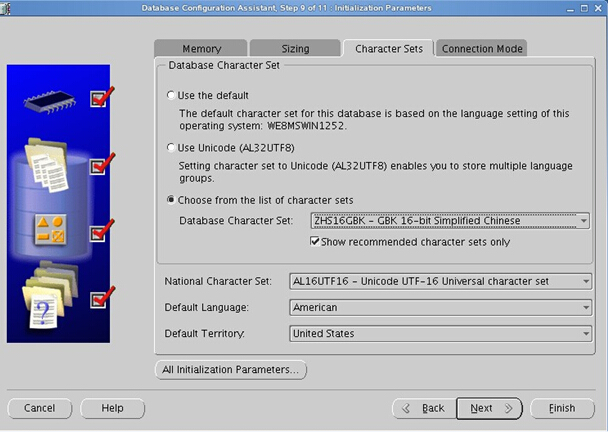

# oracle11g R2 安装配置过程

[TOC]

### version
```
linux    : rhel server 6.5
yum      : 使用本地yum源，/yum
oracle   ：oracle11g R2
hostname : dbserver
```


### 账户信息
```
IP：10.168.125.71
root:*************
oracle:1qaz!QAZ

https://dbserver:1158/em
用户名 / 密码               登录身份                              说明
sys/1qaz!QAZ      SYSDBA 或 SYSOPER        不能以 NORMAL 登录，可作为默认的系统管理员
system/1qaz!QAZ     SYSDBA 或 NORMAL       不能以 SYSOPER 登录，可作为默认的系统管理员

```


### 服务开启、关闭、重启

- 开启oracle服务
```
# /etc/rc.d/init.d/oracle start
```

- 关闭oracle服务
```
# /etc/rc.d/init.d/oracle stop
```

- 重启oracle服务
```
# /etc/rc.d/init.d/oracle restart
```


### install 过程
```
[root@dbserver ~]# vi /etc/sysconfig/network-scripts/ifcfg-eth0
DEVICE=eth0
HWADDR=00:50:56:80:09:DA
TYPE=Ethernet
UUID=2cf19688-cb0a-416b-810c-0ce43d2d80f7
ONBOOT=yes
NM_CONTROLLED=yes
BOOTPROTO=static
IPADDR=10.168.125.71
NETMASK=255.255.255.0
GATEWAY=10.168.125.254
HOSTNAME=dbserver
[root@dbserver ~]# service network start

[root@dbserver ~]# iptables -F
[root@dbserver ~]# ip6tables -F
[root@dbserver ~]# setenforce 0
[root@dbserver ~]# chkconfig --del iptables
[root@dbserver ~]# sed -i '/^SELINUX/c SELINUX=disabled' /etc/selinux/config

[root@dbserver ~]# mkdir /yum
[root@dbserver ~]# mount -t iso9660 /dev/cdrom /mnt/
[root@dbserver ~]# cp -R /mnt/* /yum/
[root@dbserver ~]# umount /mnt/
[root@dbserver ~]# vi /etc/yum.repos.d/rhel6.5.repo
[rhel6u5]
name=rhel6u5
baseurl=file:///yum
enabled=1
gpgcheck=0
[root@dbserver ~]# yum clean all
[root@dbserver ~]# yum repolist

[root@dbserver ~]# yum install binutils-2.* compat-libstdc++-33* elfutils-libelf-0.* elfutils-libelf-devel-* gcc-c++* binutils-* gcc-4* compat-libcap* compat-libstdc++* glibc-2* glibc-devel-2* ksh libgcc-* libstdc++* libaio* libaio-devel* make* sysstat* 

[root@dbserver ~]# yum -y install binutils compat-libcap1  compat-libstdc++-33 compat-libstdc++-33*.i686 elfutils-libelf-devel gcc gcc-c++ glibc*.i686 glibc glibc-devel glibc-devel*.i686 ksh libgcc*.i686 libgcc libstdc++ libstdc++*.i686 libstdc++-devel libstdc++-devel*.i686 libaio libaio*.i686 libaio-devel libaio-devel*.i686 make sysstat unixODBC unixODBC*.i686 unixODBC-devel unixODBC-devel*.i686 libXp

[root@dbserver ~]# yum groupinstall -y "X Window System"
[root@dbserver ~]# yum groupinstall -y "Desktop"
[root@dbserver ~]# yum install -y tigervnc tigervnc-server
[root@dbserver ~]# yum -y install libXext*
[root@dbserver ~]# yum install libXext.i686
[root@dbserver ~]# yum install libXext-devel.i686
[root@dbserver ~]# yum install firefox*

安装vmware tools，将该软件光盘连接至虚拟机
[root@dbserver ~]# mount -t iso9660 /dev/cdrom /mnt/
[root@dbserver ~]# mkdir -p /tmp/vm
[root@dbserver ~]# cp -R  /mnt/ /tmp/vm/
[root@dbserver ~]# umount /mnt/
[root@dbserver ~]# cd /tmp/vm/
[root@dbserver ~]# tar -xvzf VMwareTools-9.10.0-2476743.tar.gz
[root@dbserver ~]# cd vmware-tools-distrib/
[root@dbserver ~]# ./vmware-install.pl

[root@dbserver ~]# service cups stop
[root@dbserver ~]# chkconfig cups off
[root@dbserver ~]# service postfix stop
[root@dbserver ~]# chkconfig postfix off
[root@dbserver ~]# vi /etc/hosts
10.168.125.71   dbserver        localhost

[root@dbserver ~]# groupadd -g 1000 oinstall
[root@dbserver ~]# groupadd -g 1100 dba
[root@dbserver ~]# useradd -m -g oinstall -G dba -u 1200 oracle
[root@dbserver ~]# passwd oracle
[root@dbserver ~]# id oracle

[root@dbserver ~]# mkdir -p /u01/app/oracle/product/11.2.0/db_1
[root@dbserver ~]# chown -R oracle:oinstall /u01/app/
[root@dbserver ~]# chmod -R 775 /u01/app/

[root@dbserver ~]# vi /etc/sysctl.conf
# Controls the maximum shared segment size, in bytes
#kernel.shmmax = 68719476736

# Controls the maximum number of shared memory segments, in pages
#kernel.shmall = 4294967296
fs.aio-max-nr = 1048576
fs.file-max = 6815744
kernel.shmall = 2097152
kernel.shmmax = 8000000000
kernel.shmmni = 4096
kernel.sem = 250 32000 100 128
net.ipv4.ip_local_port_range = 9000 65500
net.core.rmem_default = 262144
net.core.rmem_max = 4194304
net.core.wmem_default = 262144
net.core.wmem_max = 1048576
[root@dbserver ~]# sysctl -p

[root@dbserver ~]# vi /etc/security/limits.conf
oracle              soft    nproc   2047
oracle              hard    nproc   16384
oracle              soft    nofile  1024
oracle              hard    nofile  65536
oracle              soft    stack   10240
注意：修改此文件是即时生效的，但可能要重登录后再看
[root@dbserver ~]# ulimit -Sn
[root@dbserver ~]# ulimit -Hn

[root@dbserver ~]# vi /etc/pam.d/login
#session required /lib/security/pam_limits.so
session required pam_limits.so

[root@dbserver ~]# vi /etc/profile
if [ $USER = "oracle" ]; then
    if [ $SHELL = "/bin/ksh" ]; then
        ulimit -p 16384
        ulimit -n 65536
    else
        ulimit -u 16384 -n 65536
    fi
fi

[root@dbserver ~]# vi ~oracle/.bash_profile
TMP=/tmp; export TMP
TMPDIR=$TMP; export TMPDIR
ORACLE_HOSTNAME=dbserver; export ORACLE_HOSTNAME
ORACLE_UNQNAME=ORADB; export ORACLE_UNQNAME
ORACLE_BASE=/u01/app/oracle; export ORACLE_BASE
ORACLE_HOME=$ORACLE_BASE/product/11.2.0/db_1; export ORACLE_HOME
ORACLE_SID=ORADB; export ORACLE_SID
PATH=/usr/sbin:$PATH; export PATH
PATH=$ORACLE_HOME/bin:$PATH; export PATH
LD_LIBRARY_PATH=$ORACLE_HOME/lib:/lib:/usr/lib; export LD_LIBRARY_PATH
CLASSPATH=$ORACLE_HOME/jlib:$ORACLE_HOME/rdbms/jlib; export CLASSPATH
[root@dbserver ~]# source ~oracle/.bash_profile

[root@dbserver ~]# vi /etc/inittab
id:5:initdefault:
[root@dbserver ~]# reboot

[root@dbserver ~]# startx
[root@dbserver ~]# service vncserver start
[root@dbserver ~]# vncserver
设置密码为1qaz!QAZ
[root@dbserver ~]# chkconfig --list | grep vnc
[root@dbserver ~]# chkconfig vncserver on
[root@dbserver ~]# export DISPLAY=dbserver:1
[root@dbserver ~]# xhost +
[root@dbserver ~]# mv /tmp/linux.x64_11gR2_database_* /u01/app/oracle/
[root@dbserver ~]# su oracle

[oracle@dbserver ~]$ cd /u01/app/oracle/
[oracle@dbserver ~]$ unzip linux.x64_11gR2_database_1of2.zip
[oracle@dbserver ~]$ unzip linux.x64_11gR2_database_2of2.zip
[oracle@dbserver ~]$ unset LANG LANGUAGE

以oracle用户登陆图形化桌面，并打开一个终端
[oracle@dbserver ~]$ cd /u01/app/oracle/database/
[oracle@dbserver ~]$ ./runInstaller

```


配置完之后，接着以root账户执行两个脚本,配置完即可。
```
[root@dbserver ~]# ./u01/app/oraInventory/orainstRoot.sh 
[root@dbserver ~]# ./u01/app/oracle/product/11.2.0/db_1/root.sh
```


接着用oracle账户登陆图形化界面，打开终端，输入dbca，会打开如下节目
```
[oracle@dbserver ~]$ dbca
```




接着下一步，进行配置，配置过程会比较长，可能需要20分钟左右。
配置完之后，oracle数据库即安装完毕，可以进行测试。

### 测试oracle是否正常安装
```
[oracle@dbserver ~]$ lsnrctl start
[oracle@dbserver ~]$ emctl start dbconsole
[oracle@dbserver ~]$ netstat -tlnup | grep 1521
[oracle@dbserver ~]$ netstat -tlnup | grep 1158
[oracle@dbserver ~]$ sqlplus / as sysdba
[oracle@dbserver ~]$ SQL>startup
[oracle@dbserver ~]$ SQL>shutdown abort
```
如果没有错误提示，则正常安装完毕。如果提示em不正常，可以重建：
```
[oracle@dbserver ~]$ emca -config dbcontrol db #配置数据库的 Database Control
```


### 设置开机自动开启服务
````
[使用root用户]
# vi oracle
#!/bin/bash
#
#################FUNCTION#############
#
# AutoStart Oracle and listener
# AutoStop Oracle and listener
#
#####################################
#
# Created by ZFSFOT 2005-09-15
# 
case "$1" in
start)
echo "Starting Oracle Databases ... " 
echo "-------------------------------------------------" >> /var/log/oracle
date +" %T %a %D : Starting Oracle Databasee as part of system up." >> /var/log/oracle
echo "-------------------------------------------------" >> /var/log/oracle
su - oracle -c "dbstart" >> /var/log/oracle
echo "Done."
echo "Starting Oracle Listeners ... " 
echo "-------------------------------------------------" >> /var/log/oracle
date +" %T %a %D : Starting Oracle Listeners as part of system up." >> /var/log/oracle
echo "-------------------------------------------------" >> /var/log/oracle
su - oracle -c "lsnrctl start" >> /var/log/oracle
echo "Done."
echo ""
echo "-------------------------------------------------" >> /var/log/oracle
date +" %T %a %D : Finished." >> /var/log/oracle
echo "-------------------------------------------------" >> /var/log/oracle
touch /var/lock/subsys/oracle
;;
stop)
echo "Stoping Oracle Listeners ... " 
echo "-------------------------------------------------" >> /var/log/oracle
date +" %T %a %D : Stoping Oracle Listener as part of system down." >> /var/log/oracle
echo "-------------------------------------------------" >> /var/log/oracle
su - oracle -c "lsnrctl stop" >> /var/log/oracle
echo "Done."
rm -f /var/lock/subsys/oracle
echo "Stoping Oracle Databases ... "
echo "-------------------------------------------------" >> /var/log/oracle
date +" %T %a %D : Stoping Oracle Databases as part of system down." >> /var/log/oracle
echo "-------------------------------------------------" >> /var/log/oracle
su - oracle -c "dbshut" >>/var/log/oracle
echo "Done."
echo ""
echo "-------------------------------------------------" >> /var/log/oracle
date +" %T %a %D : Finished." >> /var/log/oracle
echo "-------------------------------------------------" >> /var/log/oracle
;;
restart)
$0 stop
$0 start
;;
*)
echo "Usage: oracle {start|stop|restart}" 
exit 1
esac
````
将脚本命名为oracle，保存在/etc/rc.d/init.d下
改变文件属性：chmod 755 oracle
```
# chmod 755 oracle
# mv oracle /etc/rc.d/init.d/
```
注意：在windows下编辑此文件时有DOS格式字符导致在linux下不能够正常运行，建议用gedit 或用 vi编辑

3、建立服务连接：
系统启动时启动数据库，我们需要以下连结∶
```
$ ln -s /etc/rc.d/init.d/oracle /etc/rc.d/rc2.d/S99oracle
$ ln -s /etc/rc.d/init.d/oracle /etc/rc.d/rc3.d/S99oracle
$ ln -s /etc/rc.d/init.d/oracle /etc/rc.d/rc5.d/S99oracle
```

要在重新启动时停止数据库，我们需要以下连结∶ 
```
$ ln -s /etc/rc.d/init.d/oracle /etc/rc.d/rc0.d/K01oracle # 停止
$ ln -s /etc/rc.d/init.d/oracle /etc/rc.d/rc6.d/K01oracle # 重新启动
```


### 附件：db.rsp 文件

```

[oracle@dbserver ~]$ cat /home/oracle/Desktop/db.rsp 

#-------------------------------------------------------------------------------
# Do not change the following system generated value.
#-------------------------------------------------------------------------------
oracle.install.responseFileVersion=/oracle/install/rspfmt_dbinstall_response_schema_v11_2_0

#-------------------------------------------------------------------------------
# The installation option can be one of the following
# 1. INSTALL_DB_SWONLY
# 2. INSTALL_DB_AND_CONFIG
# 3. UPGRADE_DB
#-------------------------------------------------------------------------------
oracle.install.option=INSTALL_DB_SWONLY

#-------------------------------------------------------------------------------
# This variable holds the hostname of the system as set by the user.
# It can be used to force the installation to use an alternative
# hostname rather than using the first hostname found on the system
# (e.g., for systems with multiple hostnames and network interfaces).
#-------------------------------------------------------------------------------
ORACLE_HOSTNAME=dbserver

#-------------------------------------------------------------------------------
# Unix group to be set for the inventory directory.
#-------------------------------------------------------------------------------
UNIX_GROUP_NAME=oinstall

#-------------------------------------------------------------------------------
# Inventory location.
#-------------------------------------------------------------------------------
INVENTORY_LOCATION=/u01/app/oraInventory

#-------------------------------------------------------------------------------
# Specify the languages in which the components will be installed.
#
# en   : English                  ja   : Japanese
# fr   : French                   ko   : Korean
# ar   : Arabic                   es   : Latin American Spanish
# bn   : Bengali                  lv   : Latvian
# pt_BR: Brazilian Portuguese     lt   : Lithuanian
# bg   : Bulgarian                ms   : Malay
# fr_CA: Canadian French          es_MX: Mexican Spanish
# ca   : Catalan                  no   : Norwegian
# hr   : Croatian                 pl   : Polish
# cs   : Czech                    pt   : Portuguese
# da   : Danish                   ro   : Romanian
# nl   : Dutch                    ru   : Russian
# ar_EG: Egyptian                 zh_CN: Simplified Chinese
# en_GB: English (Great Britain)  sk   : Slovak
# et   : Estonian                 sl   : Slovenian
# fi   : Finnish                  es_ES: Spanish
# de   : German                   sv   : Swedish
# el   : Greek                    th   : Thai
# iw   : Hebrew                   zh_TW: Traditional Chinese
# hu   : Hungarian                tr   : Turkish
# is   : Icelandic                uk   : Ukrainian
# in   : Indonesian               vi   : Vietnamese
# it   : Italian
#
# Example : SELECTED_LANGUAGES=en,fr,ja
#-------------------------------------------------------------------------------
SELECTED_LANGUAGES=en,zh_CN,zh_TW

#-------------------------------------------------------------------------------
# Complete path of the Oracle Home
#-------------------------------------------------------------------------------
ORACLE_HOME=/u01/app/oracle/product/11.2.0/db_1

#-------------------------------------------------------------------------------
# Complete path of the Oracle Base.
#-------------------------------------------------------------------------------
ORACLE_BASE=/u01/app/oracle

#-------------------------------------------------------------------------------
# Installation Edition of the component.
#
# The value should contain only one of these choices.
# EE     : Enterprise Edition
# SE     : Standard Edition
# SEONE  : Standard Edition One
# PE     : Personal Edition (WINDOWS ONLY)
#-------------------------------------------------------------------------------
oracle.install.db.InstallEdition=EE

#-------------------------------------------------------------------------------
# This property is considered only if InstallEdition is EE.
#
# true  : Components mentioned as part of 'customComponents' property
#         are considered for install.
# false : Value for 'customComponents' is not considered.
#-------------------------------------------------------------------------------
oracle.install.db.isCustomInstall=false

#-------------------------------------------------------------------------------
# This property is considered only if 'IsCustomInstall' is set to true
#
# Description: List of Enterprise Edition Options you would like to install.
#
#              The following choices are available. You may specify any
#              combination of these choices.  The components you choose should
#              be specified in the form "internal-component-name:version"
#              Below is a list of components you may specify to install.
#
#              oracle.oraolap:11.2.0.0.2 - Oracle OLAP
#              oracle.rdbms.dm:11.2.0.0.2 - Oracle Data Mining RDBMS Files
#              oracle.rdbms.dv:11.2.0.0.2 - Oracle Database Vault option
#              oracle.rdbms.lbac:11.2.0.0.2 - Oracle Label Security
#              oracle.rdbms.partitioning:11.2.0.0.2 - Oracle Partitioning
#              oracle.rdbms.rat:11.2.0.0.2 - Oracle Real Application Testing
#              oracle.clrintg.ode_net:11.2.0.0.2 - Oracle Database Extensions for .NET 1.x (Windows)
#              oracle.clrintg.ode_net_2:11.2.0.0.2 - Oracle Database Extensions for .NET 2.0 (Windows)
#-------------------------------------------------------------------------------
oracle.install.db.customComponents=

#-------------------------------------------------------------------------------
oracle.install.db.DBA_GROUP=dba

#-------------------------------------------------------------------------------
oracle.install.db.OPER_GROUP=oinstall

#-------------------------------------------------------------------------------
# This variable represents the cluster node names selected by the .
# user for installation
#-------------------------------------------------------------------------------
oracle.install.db.CLUSTER_NODES=

#-------------------------------------------------------------------------------
# One of the following
# - GENERAL_PURPOSE
# - TRANSACTION_PROCESSING
# - DATAWAREHOUSE
#-------------------------------------------------------------------------------
oracle.install.db.config.starterdb.type=GENERAL_PURPOSE

#-------------------------------------------------------------------------------
# Global Database Name
#-------------------------------------------------------------------------------
oracle.install.db.config.starterdb.globalDBName=

#-------------------------------------------------------------------------------
# The Starter Database SID
#-------------------------------------------------------------------------------
oracle.install.db.config.starterdb.SID=

#-------------------------------------------------------------------------------
# Database character set
#
#  One of the following
#  AL32UTF8, WE8ISO8859P15, WE8MSWIN1252, EE8ISO8859P2,
#  EE8MSWIN1250, NE8ISO8859P10, NEE8ISO8859P4, BLT8MSWIN1257,
#  BLT8ISO8859P13, CL8ISO8859P5, CL8MSWIN1251, AR8ISO8859P6,
#  AR8MSWIN1256, EL8ISO8859P7, EL8MSWIN1253, IW8ISO8859P8,
#  IW8MSWIN1255, JA16EUC, JA16EUCTILDE, JA16SJIS, JA16SJISTILDE,
#  KO16MSWIN949, ZHS16GBK, TH8TISASCII, ZHT32EUC, ZHT16MSWIN950,
#  ZHT16HKSCS, WE8ISO8859P9, TR8MSWIN1254, VN8MSWIN1258
#-------------------------------------------------------------------------------
oracle.install.db.config.starterdb.characterSet=
#-------------------------------------------------------------------------------
# Specify the total memory allocation for the database. (in MB)
# Value should be at least 256 MB, and should not exceed the
# total physical memory available on the system.
# Example: oracle.install.db.config.starterdb.memoryLimit=40
#-------------------------------------------------------------------------------
oracle.install.db.config.starterdb.memoryLimit=
oracle.install.db.config.starterdb.memoryOption=false

#-------------------------------------------------------------------------------
# This variable controls whether to load Example Schemas onto
# the starter database or not.
#-------------------------------------------------------------------------------
oracle.install.db.config.starterdb.installExampleSchemas=false

#-------------------------------------------------------------------------------
# This include enabling audit settings, configuring password
# profiles and revoking some grants to public. These settings
# are provided by default.  You may choose to disable all.
#-------------------------------------------------------------------------------
oracle.install.db.config.starterdb.enableSecuritySettings=true

#-------------------------------------------------------------------------------
oracle.install.db.config.starterdb.password.ALL=

#-------------------------------------------------------------------------------
oracle.install.db.config.starterdb.password.SYS=

#-------------------------------------------------------------------------------
oracle.install.db.config.starterdb.password.SYSTEM=

#-------------------------------------------------------------------------------
oracle.install.db.config.starterdb.password.SYSMAN=

#-------------------------------------------------------------------------------
oracle.install.db.config.starterdb.password.DBSNMP=

#-------------------------------------------------------------------------------
# Can be one of the following
# 1. GRID_CONTROL
# 2. DB_CONTROL
#
oracle.install.db.config.starterdb.control=DB_CONTROL

#-------------------------------------------------------------------------------
# Determines the Management Service to use if Grid Control
# is selected to manage the database.
#-------------------------------------------------------------------------------
oracle.install.db.config.starterdb.gridcontrol.gridControlServiceURL=

#-------------------------------------------------------------------------------
# Determines whether to receive email notification for
# critical alerts when using DB control.
#-------------------------------------------------------------------------------
oracle.install.db.config.starterdb.dbcontrol.enableEmailNotification=false

#-------------------------------------------------------------------------------
oracle.install.db.config.starterdb.dbcontrol.emailAddress=

#-------------------------------------------------------------------------------
oracle.install.db.config.starterdb.dbcontrol.SMTPServer=

#-------------------------------------------------------------------------------
oracle.install.db.config.starterdb.automatedBackup.enable=false

#-------------------------------------------------------------------------------
oracle.install.db.config.starterdb.automatedBackup.osuid=

#-------------------------------------------------------------------------------
oracle.install.db.config.starterdb.automatedBackup.ospwd=

#-------------------------------------------------------------------------------
# Can be one of the following
# - FILE_SYSTEM_STORAGE
# - ASM_STORAGE
#-------------------------------------------------------------------------------
oracle.install.db.config.starterdb.storageType=

#-------------------------------------------------------------------------------
# Database file location:
# directory for datafiles, control files, redo logs.
#
# Applicable only when oracle.install.db.config.starterdb.storage=FILE_SYSTEM_STORAGE
#-------------------------------------------------------------------------------
oracle.install.db.config.starterdb.fileSystemStorage.dataLocation=

#-------------------------------------------------------------------------------
# Backup and recovery location
#
# Applicable only when oracle.install.db.config.starterdb.storage=FILE_SYSTEM_STORAGE
#-------------------------------------------------------------------------------
oracle.install.db.config.starterdb.fileSystemStorage.recoveryLocation=

#-------------------------------------------------------------------------------
# Name of ASM disk group to be used for storage.
#
# Applicable only when oracle.install.db.config.starterdb.storageType=ASM_STORAGE
#-------------------------------------------------------------------------------
oracle.install.db.config.asm.diskGroup=

#-------------------------------------------------------------------------------
# Password for ASMSNMP user of the ASM instance.
#
# Applicable only when oracle.install.db.config.starterdb.storage=ASM_STORAGE
#-------------------------------------------------------------------------------
oracle.install.db.config.asm.ASMSNMPPassword=

#------------------------------------------------------------------------------
# Specify the My Oracle Support Account Username.
#
#  Example   : MYORACLESUPPORT_USERNAME=metalink
#------------------------------------------------------------------------------
MYORACLESUPPORT_USERNAME=

#------------------------------------------------------------------------------
# Specify the My Oracle Support Account Username password.
#
# Example    : MYORACLESUPPORT_PASSWORD=password
#------------------------------------------------------------------------------
MYORACLESUPPORT_PASSWORD=

#------------------------------------------------------------------------------
# Specify whether to enable the user to set the password for
# My Oracle Support credentials. The value can be either true or false.
# If left blank it will be assumed to be false.
#
# Example    : SECURITY_UPDATES_VIA_MYORACLESUPPORT=true
#------------------------------------------------------------------------------
SECURITY_UPDATES_VIA_MYORACLESUPPORT=false

#------------------------------------------------------------------------------
# Specify whether user wants to give any proxy details for connection.
# The value can be either true or false. If left blank it will be assumed
# to be false.
#
# Example    : DECLINE_SECURITY_UPDATES=false
#------------------------------------------------------------------------------
DECLINE_SECURITY_UPDATES=true

#------------------------------------------------------------------------------
# Specify the Proxy server name. Length should be greater than zero.
#
# Example    : PROXY_HOST=proxy.domain.com
#------------------------------------------------------------------------------
PROXY_HOST=

#------------------------------------------------------------------------------
# Specify the proxy port number. Should be Numeric and atleast 2 chars.
#
# Example    : PROXY_PORT=25
#------------------------------------------------------------------------------
PROXY_PORT=%

```


